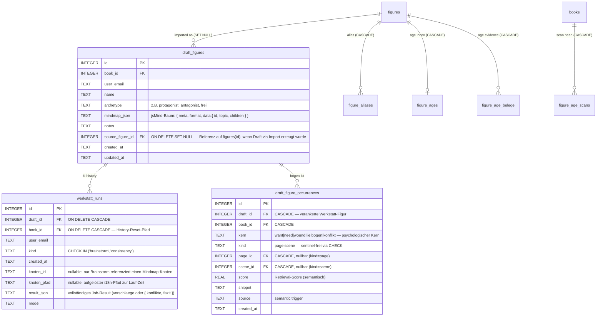
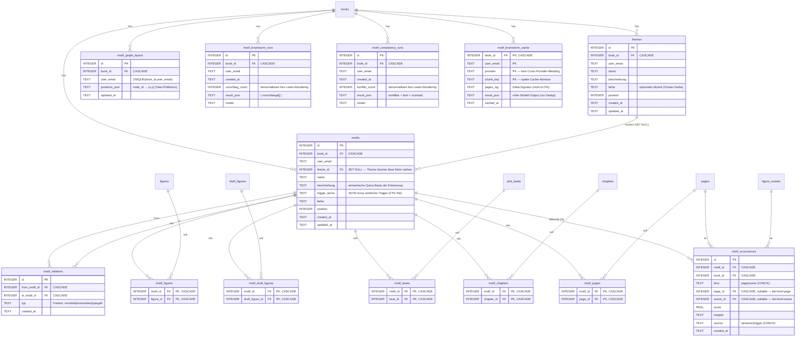

# ERD — schreibwerkstatt

Stand: Schema-Version 323, 179 Tabellen (ohne `sqlite_*`/`schema_version`/FTS5-Shadow-Tables; inkl. FTS5-Virtual `search_index`/`search_trigram` + `search_meta`).

Quelle: Squashed-Schema-Snapshot in [db/squashed-schema.js](../db/squashed-schema.js) (regeneriert via `node tools/dump-schema.js`) + [db/migrations.js](../db/migrations.js). Drift gegen die Legacy-Migration-Kette ist durch [tests/unit/squash-drift.test.mjs](../tests/unit/squash-drift.test.mjs) gegated. Mermaid-Diagramme — in VSCode mit „Markdown Preview Mermaid Support" (oder GitHub) direkt sichtbar.

> **Pflege.** Datei MUSS bei jeder neuen Migration mitgepflegt werden — Stand-Zeile (Schema-Version, Tabellen-Anzahl) + betroffene Block-Definitionen + ggf. neue Mermaid-Tabelle/-Kante. Siehe Doku-Regel in [CLAUDE.md](../CLAUDE.md) → „Datenbank → Migration hinzufügen". **Nach jeder Migration zusätzlich [db/squashed-schema.js](../db/squashed-schema.js) regenerieren** (`node tools/dump-schema.js > /tmp/out.sql` + Build-Step) — sonst bricht der Drift-Test in CI.

---

## 1 · Übersicht (alle FK-Kanten, ohne Attribute)

```mermaid
erDiagram
  books ||--o{ chapters              : has
  books ||--o{ pages                 : has
  books ||--o{ page_deletions        : logs
  chapters |o--o{ page_deletions     : trashed_from
  chapters ||--o{ pages              : groups
  chapters ||--o{ chapters           : "parent (max 3 levels)"

  books ||--o{ figures               : has
  books ||--o{ locations             : has
  books ||--o{ figure_scenes         : has
  books ||--o{ songs                 : has
  books ||--o{ world_facts           : has
  books ||--o{ world_facts_scan      : has
  books ||--o{ world_fact_verdicts   : has
  books ||--o{ figure_relations      : has
  books ||--o{ zeitstrahl_events     : has
  books ||--o{ continuity_checks     : has
  books ||--o{ continuity_issues     : has
  books ||--o{ chapter_narrative_profile : has
  books ||--o{ book_reviews          : has
  books ||--o{ chapter_reviews       : has
  books ||--o{ book_stats_history    : has
  books ||--o{ page_stats            : has
  books ||--|| book_settings         : has
  books ||--o{ job_checkpoints       : has
  books ||--o{ job_runs              : has
  books ||--o{ ai_cost_ledger        : has
  books ||--o{ chat_sessions         : has
  books ||--o{ ideen                 : has
  ideen ||--o{ idea_links            : links
  research_items ||--o{ idea_links   : "linked from"
  plot_beats ||--o{ idea_links       : "linked from"
  motifs ||--o{ idea_links           : "linked from"
  draft_figures ||--o{ idea_links    : "linked from"
  plot_threads ||--o{ idea_links     : "linked from"
  books ||--o{ book_source_links     : uses
  sources ||--o{ book_source_links   : "used by"
  sources ||--o{ source_tags         : tagged
  sources ||--o{ source_citations    : "cited in"
  pages ||--o{ source_citations      : cites
  books ||--o{ source_detect_runs    : "detection runs"
  chapters ||--o{ source_detect_runs : "scoped to"
  sources ||--o{ source_semantic_chunks : "PDF text embedded"
  pages ||--o{ xref_anchors          : "numbers"
  pages ||--o{ xref_links            : "refers from"
  chapters ||--o{ xref_links         : "referred to"
  books ||--o{ pdf_export_profile    : has
  books ||--o{ docx_export_profile   : has
  books ||--|| book_publication      : has
  books ||--o{ user_page_usage       : has
  books ||--o{ book_access           : has
  books ||--o{ book_shelf            : "shelved by"
  books ||--o{ komplett_scope        : "run scope"
  books ||--o{ book_share_invites    : has
  books ||--o{ page_locks            : locks
  books ||--o{ writing_time          : has
  books ||--o{ writing_hour          : has
  books ||--o{ writing_session       : has
  books ||--o{ lektorat_time         : has
  books ||--o{ stt_time              : has
  books ||--o{ chapter_extract_cache : has
  books ||--o{ book_extract_cache    : has
  books ||--o{ chapter_review_cache  : has
  books ||--o{ book_review_cache     : has
  books ||--o{ ungrouped_review_cache : has
  books ||--o{ ungrouped_extract_cache : has
  books ||--o{ chapter_macro_review_cache : has
  books ||--o{ tagebuch_rueckblick_cache : has
  books ||--o{ tagebuch_rueckblicke  : has
  books ||--o{ lektorat_cache        : has
  books ||--o{ finetune_ai_cache     : has
  books ||--o{ draft_figures         : has
  books ||--o{ werkstatt_runs        : has
  books ||--o{ storylines            : has
  storylines ||--o{ zeitstrahl_events : groups
  storylines ||--o{ figure_events     : groups
  books ||--o{ plot_acts             : has
  books ||--o{ plot_beats            : has
  books ||--o{ plot_threads          : has
  plot_acts ||--o{ plot_beats        : groups
  plot_threads ||--o{ plot_acts      : "own acts (hybrid)"
  plot_threads ||--o| plot_beats     : "beat in lane"
  figures ||--o| plot_threads        : "thread of figure"
  draft_figures ||--o| plot_threads  : "thread of draft figure"
  chapters ||--o| plot_threads       : "thread chapter"
  chapters ||--o| plot_beats         : "beat lands in"
  books ||--o{ plot_consistency_runs : has
  books ||--o{ plot_brainstorm_runs  : has
  plot_acts ||--o| plot_brainstorm_runs : "for act"
  plot_threads ||--o| plot_brainstorm_runs : "for thread"
  books ||--o{ themes                : has
  books ||--o{ motifs                : has
  books ||--o{ motif_graph_layout    : has
  books ||--o{ motif_brainstorm_runs : has
  books ||--o{ motif_consistency_runs : has
  themes ||--o{ motifs               : clusters
  motifs ||--o{ motif_relations      : "motif ↔ motif"
  motifs ||--o{ motif_figures        : "soll figure"
  motifs ||--o{ motif_draft_figures  : "soll draft figure"
  motifs ||--o{ motif_beats          : "soll beat"
  motifs ||--o{ motif_chapters       : "soll chapter"
  motifs ||--o{ motif_pages          : "soll page"
  motifs ||--o{ motif_occurrences    : "detected (ist)"
  books ||--o| book_lexicon          : "wortschatz (ist)"
  books ||--o{ lexicon_terms         : "top terms"
  books ||--o{ lexicon_ngrams        : "top phrases"
  pages ||--o{ lexicon_terms         : "first occurrence"
  pages ||--o{ lexicon_ngrams        : "first occurrence"
  books ||--o{ chapter_lexicon       : "kapitel-band"
  chapters ||--o| chapter_lexicon    : "wortschatz je kapitel"
  books ||--o{ figure_idiolect       : "idiolekt"
  figures ||--o| figure_idiolect     : "rede der figur"
  plot_beats ||--o{ plot_beat_figures : has
  plot_beats ||--o{ plot_beat_locations : "spielt-an"
  locations  ||--o{ plot_beat_locations : "schauplatz-von"
  figures ||--o{ plot_beat_figures   : "appears in beat"
  plot_beats ||--o{ plot_beat_draft_figures : has
  draft_figures ||--o{ plot_beat_draft_figures : "appears in beat"
  plot_beats ||--o{ plot_beat_relations : "causal/setup edge"
  draft_figures ||--o{ motif_draft_figures : "soll"
  books }o--o| book_categories       : "category_id"
  books ||--o| blog_connections      : "wp-link"
  blog_connections ||--o{ blog_page_links : "has"
  pages ||--o| blog_page_links       : "wp-mirror"
  books ||--o| hubspot_connections   : "hubspot-link"
  hubspot_connections ||--o{ hubspot_page_links : "has"
  pages ||--o| hubspot_page_links    : "hubspot-mirror"

  books ||--o{ share_links           : has
  pages ||--o{ share_links           : "shared as page"
  chapters ||--o{ share_links        : "shared as chapter"
  app_users ||--o{ share_links       : owns
  share_links ||--o{ share_comments  : has
  share_links ||--o{ share_views      : "access log"
  share_links ||--o{ share_feedback   : "overall feedback"
  share_views ||--o{ share_view_sections : "per-chapter depth"
  chapters ||--o{ share_view_sections : "read depth"

  book_categories ||--o{ book_categories : parent

  draft_figures ||--o{ werkstatt_runs : "ki-history"
  draft_figures ||--o{ draft_figure_occurrences : "bogen-ist"

  pages ||--o{ page_checks           : has
  pages ||--|| page_textsorte        : has
  pages ||--|| page_structure_checks : has
  pages ||--|| page_editorial_status : has
  pages ||--|| page_headline        : has
  pages ||--o{ page_headline_variants : has
  pages ||--|| page_stats            : has
  pages ||--o{ chat_sessions         : has
  pages ||--o{ page_figure_mentions  : has
  pages ||--o{ figure_events         : at
  pages ||--o{ figure_scenes         : at
  pages ||--o{ zeitstrahl_event_pages: at
  pages ||--o{ ideen                 : at
  pages ||--o{ lektorat_time         : on
  pages ||--o{ lektorat_cache        : cached
  pages ||--o{ locations             : firstMention
  pages ||--o{ songs                 : firstMention
  pages ||--o{ figures               : firstMention
  pages ||--|| page_locks            : locked
  pages ||--o{ page_images           : "embedded images"
  pages ||--o{ page_revisions        : has
  books ||--o{ page_revisions        : has
  books ||--|| book_order            : has
  pages ||--o{ user_page_usage       : "recency of"

  pages         ||--o{ semantic_chunks : "ist (kind=page)"
  figure_scenes ||--o{ semantic_chunks : "ist (kind=scene)"
  figures       ||--o{ semantic_chunks : "ist (kind=figure)"
  research_items ||--o{ semantic_chunks : "ist (kind=research)"
  locations     ||--o{ semantic_chunks : "ist (kind=location)"
  world_facts   ||--o{ semantic_chunks : "ist (kind=fact)"
  books         ||--o{ semantic_index_state : "letzter vollständiger Index-Lauf"
  books         ||--o{ redundancy_runs : "letzter Redundanz-Radar-Lauf"
  app_users     ||--o{ redundancy_runs : "pro User"
  books         ||--o{ redundancy_dismissals : "ignorierte Paare"
  app_users     ||--o{ redundancy_dismissals : "pro User"
  pages         ||--o{ redundancy_dismissals : "Seitenpaar (kind=page)"
  figures       ||--o{ redundancy_dismissals : "Figurenpaar (kind=figure)"
  research_items ||--|| interview_transcripts : "ist (kind=transcript)"
  interview_transcripts ||--o{ interview_segments : has
  interview_transcripts ||--o{ interview_speakers : has
  sources ||--o{ interview_speakers   : "O-Ton-Quelle"

  app_users ||--o{ book_access       : grants
  app_users ||--o{ book_shelf        : "pins/archives"
  app_users ||--o{ komplett_scope    : "chooses run scope"
  app_users ||--|| author_profile    : "own style profile"
  app_users ||--o{ page_locks        : holds
  app_users ||--o{ research_items    : "sets status (status_by)"
  app_users ||--o{ page_presence     : pings
  app_users ||--o{ book_presence     : pings
  app_users ||--o{ app_users_devices : "owns devices"
  app_users ||--o{ budget_alerts     : dedupes
  app_users ||--o{ user_dictionary   : owns
  app_users ||--o{ js_errors         : logs
  app_users ||--|| user_credentials  : "local password hash"
  app_users ||--o{ user_password_tokens : "set/reset links"
  ai_profiles ||--o{ app_users       : "assigned to"
  app_users ||--o| ai_profiles       : "own API access"
  books     ||--o{ user_dictionary   : "scoped (NULL=global)"
  app_users ||--o{ languagetool_disabled_rules : "switched off"
  books     ||--o{ languagetool_disabled_rules : "scoped (NULL=global)"

  user_invites ||--o{ registration_requests : "linked invite"
  pages ||--o{ page_presence         : "online viewers"
  pages ||--o{ book_presence         : "current page"
  books ||--o{ page_presence         : has
  books ||--o{ book_presence         : "open on devices"
  app_users_devices ||--o{ page_presence : "pinged from"
  app_users_devices ||--o{ book_presence : "pinged from"
  app_users_devices ||--o{ pages         : "last edited from"

  chapters ||--o{ figure_appearances     : has
  chapters ||--o{ figure_events          : at
  chapters ||--o{ figure_scenes          : at
  chapters ||--o{ location_chapters      : has
  chapters ||--o{ continuity_issue_chapters : ref
  chapters ||--o{ zeitstrahl_event_chapters : at
  chapters ||--o{ chapter_reviews        : has
  chapters ||--o{ chapter_extract_cache  : cached
  chapters ||--o{ chapter_review_cache   : cached
  chapters ||--o{ chapter_macro_review_cache : cached
  chapters ||--o{ ideen                  : at
  chapters ||--o{ pages                  : groups
  chapters ||--o{ page_checks            : ref

  figures ||--o{ figure_tags             : tagged
  figures ||--o{ figure_appearances      : appears
  figures ||--o{ figure_events           : has
  figures ||--o{ scene_figures           : in
  figures ||--o{ location_figures        : at
  figures ||--o{ song_figures            : likes
  figures ||--o{ page_figure_mentions    : mentioned
  figures ||--o{ continuity_issue_figures: ref
  figures ||--o{ zeitstrahl_event_figures: ref
  figures ||--o{ figure_relations        : from
  figures ||--o{ figure_relations        : to
  figures ||--o{ draft_figures           : "imported as"
  figures ||--o| figure_ages             : "age index"
  figures ||--o{ figure_age_belege       : "age evidence"
  figures ||--o{ figure_aliases          : "alias"

  locations ||--o{ scene_locations       : in
  locations ||--o{ location_figures      : has
  locations ||--o{ location_chapters     : at
  locations ||--o{ locations             : parent

  songs ||--o{ song_figures              : has
  songs ||--o{ song_chapters             : at

  figure_scenes ||--o{ scene_figures     : has
  figure_scenes ||--o{ scene_locations   : has
  chapters ||--o{ song_chapters          : has

  zeitstrahl_events ||--o{ zeitstrahl_event_chapters : refs
  zeitstrahl_events ||--o{ zeitstrahl_event_pages    : refs
  zeitstrahl_events ||--o{ zeitstrahl_event_figures  : refs

  continuity_checks ||--o{ continuity_issues          : has
  continuity_issues ||--o{ continuity_issue_figures   : refs
  continuity_issues ||--o{ continuity_issue_chapters  : refs
  pages ||--o{ continuity_issues                      : "anchors stelle_a/b"

  chat_sessions ||--o{ chat_messages     : has
  chat_sessions ||--o{ chat_images       : "generated in chat"
```

---

## 2 · Buch-Hierarchie + Lektorat-Kern

```mermaid
erDiagram
  books {
    INTEGER book_id PK "AUTOINCREMENT, Watermark >=1_000_000"
    TEXT    name
    TEXT    slug
    TEXT    created_at
    TEXT    updated_at
    TEXT    last_seen_at
    TEXT    description
    TEXT    owner_email "Erst-Backfiller / book_access-Bridge"
    INTEGER category_id FK "ON DELETE SET NULL"
  }
  book_categories {
    INTEGER id          PK
    INTEGER parent_id   FK "ON DELETE SET NULL"
    TEXT    name
    TEXT    slug        "UNIQUE"
    TEXT    color
    INTEGER position
    TEXT    created_by
    TEXT    created_at
  }
  chapters {
    INTEGER chapter_id        PK "AUTOINCREMENT, Watermark >=1_000_000"
    INTEGER book_id           FK "ON DELETE CASCADE"
    INTEGER parent_chapter_id FK "ON DELETE SET NULL, NULL = top-level, max Tiefe 3"
    TEXT    chapter_name
    TEXT    updated_at
    TEXT    last_seen_at
    INTEGER position
    TEXT    slug
    INTEGER excluded "1 = aus Export/Bewertung/Komplettanalyse ausgeschlossen (Lektorat/Fassungen bleiben), kaskadiert auf Unterkapitel"
  }
  pages {
    INTEGER page_id    PK "AUTOINCREMENT, Watermark >=1_000_000"
    INTEGER book_id    FK "ON DELETE CASCADE"
    INTEGER chapter_id FK "ON DELETE SET NULL"
    TEXT    page_name
    TEXT    updated_at
    TEXT    preview_text
    TEXT    last_seen_at
    TEXT    body_html
    INTEGER position
    TEXT    slug
    TEXT    local_updated_at
    TEXT    remote_updated_at
    INTEGER dirty "Konflikterkennung Sync-Pull"
    TEXT    last_editor_email "Letzter Body-Autor; Quelle fuer Tree-/Toast-Hinweise"
    TEXT    last_editor_device_id FK "ON DELETE SET NULL; Geraet des letzten Body-Edits, geraete-bewusster /changes-Feed"
  }
  page_deletions {
    INTEGER id              PK "AUTOINCREMENT"
    INTEGER book_id         FK "ON DELETE CASCADE"
    INTEGER page_id         "geloeschte Seite (kein FK, da Seite bereits geloescht)"
    TEXT    page_name       "Name zum Zeitpunkt des Deletes"
    TEXT    deleted_at      "ISO-8601; Cursor fuer /changes-Feed"
    TEXT    deleted_by_email "Loeschender User"
    TEXT    device_id       "Geraet des Loeschers"
    TEXT    body_html       "Papierkorb: Inhalt beim Loeschen (NULL = nicht wiederherstellbar)"
    INTEGER chapter_id      FK "ON DELETE SET NULL; Kapitel beim Loeschen"
    TEXT    images_json     "Papierkorb: referenzierte Bild-BLOBs als base64"
    TEXT    restored_at     "ISO-8601; gesetzt nach Wiederherstellung"
  }
  page_stats {
    INTEGER page_id          PK,FK
    INTEGER book_id          FK
    INTEGER tok
    INTEGER words
    INTEGER chars
    INTEGER sentences
    INTEGER dialog_chars
    INTEGER filler_count
    INTEGER passive_count
    INTEGER adverb_count
    REAL    avg_sentence_len
    REAL    lix
    REAL    flesch_de
    TEXT    pronoun_counts   "JSON"
    TEXT    repetition_data  "JSON"
    TEXT    style_samples    "JSON"
    TEXT    sentence_lens    "JSON, Satzlaengen in Leserichtung"
    TEXT    opener_counts    "JSON, erstes Wort je Satz + Nachbar-Wiederholungen"
    INTEGER metrics_version
    TEXT    content_sig
    TEXT    updated_at
    TEXT    cached_at
  }
  page_revisions {
    INTEGER id            PK
    INTEGER page_id       FK "ON DELETE CASCADE"
    INTEGER book_id       FK "ON DELETE CASCADE"
    TEXT    body_html
    INTEGER chars
    INTEGER words
    INTEGER tok
    TEXT    source        "focus|main|book|chat-apply|lektorat-apply|import|conflict|macapp"
    TEXT    user_email
    TEXT    client        "Browser·OS bzw. nativer Client"
    TEXT    created_at
    TEXT    summary
  }
  page_images {
    INTEGER id          PK
    INTEGER page_id     FK "ON DELETE CASCADE"
    TEXT    mime
    INTEGER width
    INTEGER height
    INTEGER size        "bytes"
    BLOB    image
    TEXT    created_at
  }
  book_order {
    INTEGER book_id    PK,FK "ON DELETE CASCADE"
    TEXT    order_json "[{type,id,children?}], SSoT Kapitel+Seiten-Reihenfolge"
    TEXT    updated_at
    TEXT    updated_by
  }
  page_checks {
    INTEGER id          PK
    INTEGER page_id     FK
    INTEGER book_id     FK "ON DELETE SET NULL"
    INTEGER chapter_id  FK "ON DELETE SET NULL"
    TEXT    user_email
    TEXT    checked_at
    INTEGER error_count
    TEXT    errors_json
    TEXT    selected_errors_json
    TEXT    applied_errors_json
    TEXT    stilanalyse
    TEXT    fazit
    TEXT    szenen_json
    TEXT    model
    INTEGER saved
    TEXT    saved_at
  }
  page_textsorte {
    INTEGER page_id     PK,FK "ON DELETE CASCADE"
    INTEGER book_id     FK "ON DELETE CASCADE"
    TEXT    textsorte   "Override der Buch-Textsorte für genau diesen Beitrag"
    TEXT    updated_at
  }
  page_structure_checks {
    INTEGER page_id      PK,FK "ON DELETE CASCADE"
    INTEGER book_id      FK "ON DELETE CASCADE"
    TEXT    textsorte    "Textsorte, gegen deren Soll-Katalog geprüft wurde"
    TEXT    gesamturteil "traegt|lueckenhaft|verfehlt"
    TEXT    result_json  "Regel-für-Regel-Befund + fehlende W-Fragen + Zusammenfassung"
    TEXT    content_sig  "Text+Textsorte+Prompt-Stand — Delta-Skip und Stale-Erkennung"
    TEXT    created_at
  }
  page_headline {
    INTEGER page_id    PK,FK "ON DELETE CASCADE"
    INTEGER book_id    FK "ON DELETE CASCADE"
    TEXT    dachzeile  "Zeile ueber dem Titel"
    TEXT    titel      "Schlagzeile — Quelle fuer den Blog-Push"
    TEXT    lead       "Vorspann"
    TEXT    teaser     "Anreisser — Quelle fuer WP-excerpt"
    TEXT    updated_by FK "app_users(email), ON DELETE SET NULL"
    TEXT    updated_at
  }
  page_headline_variants {
    INTEGER id         PK
    INTEGER page_id    FK "ON DELETE CASCADE"
    INTEGER book_id    FK "ON DELETE CASCADE"
    TEXT    feld       "dachzeile|titel|lead|teaser (CHECK)"
    TEXT    text       "Kandidat, wird durch Uebernehmen geltender Stand"
    TEXT    herkunft   "user|ki (CHECK)"
    TEXT    created_by FK "app_users(email), ON DELETE SET NULL"
    TEXT    created_at
  }
  page_editorial_status {
    INTEGER page_id            PK,FK "ON DELETE CASCADE"
    INTEGER book_id            FK "ON DELETE CASCADE"
    TEXT    status             "roh|gegengelesen|schlussredigiert|freigegeben (CHECK)"
    TEXT    note               "Freitext der Redaktion, max. 500 Zeichen"
    TEXT    content_updated_at "pages.updated_at beim Setzen — Anker der Stale-Erkennung"
    TEXT    updated_by         FK "app_users(email), ON DELETE SET NULL"
    TEXT    updated_at
  }
  ideen {
    INTEGER id          PK
    INTEGER book_id     FK
    INTEGER page_id     FK "ON DELETE CASCADE, hoechstens einer mit chapter_id — beide NULL = Buch-Idee"
    INTEGER chapter_id  FK "ON DELETE CASCADE, hoechstens einer mit page_id"
    TEXT    user_email
    TEXT    content
    TEXT    status      "offen|in_arbeit|erledigt|verworfen — eine Spalte, ein CHECK"
    TEXT    status_at
    INTEGER sort_order  "manuelle Reihenfolge in der Board-Zelle (Bahn × Stufe), 0 = nie einsortiert"
    TEXT    created_at
    TEXT    updated_at
  }
  idea_links {
    INTEGER id          PK
    INTEGER idea_id     FK "ON DELETE CASCADE"
    TEXT    target_kind "research|beat|motif|draft|thread"
    INTEGER research_id FK "ON DELETE CASCADE, genau eins gesetzt passend zu target_kind"
    INTEGER beat_id     FK "ON DELETE CASCADE"
    INTEGER motif_id    FK "ON DELETE CASCADE"
    INTEGER draft_figure_id FK "ON DELETE CASCADE (Werkstatt-Figur)"
    INTEGER thread_id   FK "ON DELETE CASCADE (Plot-Strang)"
    TEXT    created_at
    %% partielle UNIQUE-Indexe je Ziel-Art: dieselbe Kante nur einmal
  }
  book_settings {
    INTEGER book_id                  PK,FK
    TEXT    language                 "default 'de'"
    TEXT    region                   "default 'CH'"
    TEXT    buchtyp
    TEXT    buch_kontext
    TEXT    stilprofil               "KI-destilliertes, editierbares Autorenstil-Profil (Imitations-/Bewertungs-Referenz)"
    TEXT    erzaehlperspektive
    TEXT    erzaehlzeit
    INTEGER is_finished              "0|1, blendet Schreib-Tracking aus"
    INTEGER allow_lektor_book_chat   "Lektor darf Buch-Chat (Default 0)"
    INTEGER daily_goal_chars         "Tagesziel Zeichen (NULL = Default 1500)"
    INTEGER goal_target_chars        "Schreibziel Gesamt-Zeichen (NULL = kein Ziel) → Deadline-Projektion"
    TEXT    goal_deadline            "Abgabedatum YYYY-MM-DD (NULL = keine Deadline)"
    INTEGER entities_enabled         "0|1, Figuren/Orte-Highlights + Szenen/Ereignisse-Panel im Notebook-Editor"
    INTEGER orte_real                "0|1, Orte sind reale Schauplätze → Geo-Karte in der Orte-Karte"
    TEXT    schauplatz_land          "ISO-3166-1-alpha-2 Haupt-Schauplatzland (Geocode-Bias + KI-Land-Fallback)"
    INTEGER zeitlinie_real           "0|1, Roman hat echte kalendarische Zeitlinie → Jahres-Stand in der Ereignisse-Ansicht"
    INTEGER weltfakten_real_pruefen  "0|1, Opt-in: Welt-Fakten gegen reale Faktenlage prüfen (Faktencheck-Job, Web-Suche)"
    INTEGER exclude_from_stats       "0|1, Buch vollständig aus „Meine Statistik\" ausnehmen (Testbücher)"
    TEXT    citation_style           "apa7|chicago-ad|numeric — buchweit für ALLE Ausgabewege (PDF/DOCX/WordPress/HubSpot), nie pro Exportprofil"
    INTEGER bibliography_enabled     "0|1, Quellenverzeichnis am Ende der gerenderten Einheit ausgeben"
    TEXT    bibliography_title       "Überschrift des Verzeichnisses (NULL = Sprach-Default des Renderers)"
    TEXT    bibliography_scope       "cited = nur belegte Quellen | all = auch unzitierte"
    INTEGER bibliography_in_blog     "0|1, Verzeichnis an Blog-/HubSpot-Posts anhängen (dort ist die Einheit die Seite = ein Post)"
    TEXT    citation_notes           "inline = Kurzbeleg im Fliesstext | endnotes = Anmerkungsapparat pro Kapitel | footnotes = Apparat am Seitenfuss (PDF/Word; übrige Formate zeigen den Kapitelapparat)"
    TEXT    textsorte                "vorherrschende journalistische Textsorte (nachricht|bericht|reportage|interview|portraet|feature|kommentar|glosse|rezension) — Default für jede Seite ohne eigenen Override"
    INTEGER figure_numbering         "0|1, Abbildungen kapitelweise nummerieren („Abb. 3.2\") — buchweit, nie pro Exportprofil"
    INTEGER table_numbering          "0|1, Tabellen kapitelweise nummerieren („Tab. 3.2\") — eigener Zähler neben den Abbildungen"
    TEXT    research_profile         "Freitext-Steuerung des Recherche-Chats (Fachgebiet, Quellenarten, Zitierwünsche) — geht als VORRANGIGE ANGABEN in dessen System-Prompt"
    TEXT    research_domains         "Domain-Eingrenzung der Web-Suche, eine pro Zeile (NULL/leer = offenes Web) → `allowed_domains` am web_search-Werkzeug"
    TEXT    ideen_stages             "aktive Ideen-Stufen, Komma-Text in kanonischer Reihenfolge (offen + erledigt immer; in_arbeit/verworfen zuschaltbar; NULL = alle vier)"
    TEXT    updated_at
  }
  book_snapshots {
    INTEGER id            PK
    INTEGER book_id       FK "ON DELETE CASCADE"
    INTEGER seq           "fortlaufende Fassungsnummer pro Buch"
    TEXT    label
    TEXT    description
    TEXT    content_json  "buildBookJson-Output ({book, tree:[node…]}) mit Seiten-HTML inline"
    TEXT    extras_json   "collectExtras (Analyse + Lektorat) für Restore"
    TEXT    publication_json "eingefrorene book_publication (Titelei/epub_*/Cover+Foto base64) für Fassungs-Export + Restore"
    TEXT    lektorat_metrics "verdichtete Lektorat-Kennzahl beim Capture (JSON {open,applied,all}×{total,byTyp}) für den Fehlerdichte-Trend in der Heatmap-Karte"
    INTEGER chars
    INTEGER words
    INTEGER pages
    INTEGER chapters
    TEXT    user_email
    TEXT    created_at
    TEXT    published_at "NULL = nicht veröffentlicht; sonst Zeitpunkt der Auflage-Markierung (Publikations-Anker + Lösch-Schutz)"
  }
  name_guard_ignores {
    INTEGER id            PK
    INTEGER book_id       FK "ON DELETE CASCADE"
    TEXT    user_email
    TEXT    canonical     "Stammname (Display/Kontext)"
    TEXT    variant       "unterdrueckte Schreibvariante"
    TEXT    created_at
    %% UNIQUE(book_id, user_email, variant)
  }
  research_items {
    INTEGER id          PK
    INTEGER book_id     FK "ON DELETE CASCADE"
    TEXT    user_email  "Ersteller-Attribution (kein Sichtbarkeits-Scope; buchweit geteilt)"
    TEXT    kind        "note|link|quote|fact|image|document|transcript"
    TEXT    title
    TEXT    body        "Plain-Text"
    TEXT    source      "Quellen-/Zitatnachweis"
    BLOB    image       "bei kind=image, sharp-normalisiert"
    TEXT    image_mime
    BLOB    doc         "bei kind=document, Original-PDF"
    TEXT    doc_mime    "application/pdf"
    TEXT    doc_name    "Original-Dateiname"
    TEXT    doc_text    "extrahierter Plain-Text (FTS + KI-Verknuepfung)"
    INTEGER doc_pages
    INTEGER doc_chars   "Laenge von doc_text — == MAX_TEXT_CHARS heisst: Volltext gedeckelt"
    TEXT    status      "offen|in_arbeit|eingearbeitet|verworfen — Einarbeitungs-Achse (Spalten des Status-Boards); NEBEN archived, nicht darin"
    TEXT    status_at   "wann der Status zuletzt gesetzt wurde (ISO+Z)"
    TEXT    status_by   FK "app_users(email), ON DELETE SET NULL — wer ihn gesetzt hat"
    INTEGER pinned
    INTEGER archived
    TEXT    created_at
    TEXT    updated_at
  }
  interview_transcripts {
    INTEGER item_id     PK,FK "research_items(id), ON DELETE CASCADE"
    INTEGER book_id     FK "ON DELETE CASCADE"
    BLOB    audio       "Original-Aufnahme, loeschbar ohne den Wortlaut zu verlieren"
    TEXT    audio_mime
    TEXT    audio_name
    INTEGER audio_bytes
    REAL    duration_s
    TEXT    status      "pending|running|ready|error (CHECK)"
    TEXT    fehler      "Grund bei status=error, an der Zeile statt nur im Job-Log"
    TEXT    sprache
    TEXT    modell
    INTEGER diarisiert  "0|1 — ob das Backend Sprecher geliefert hat"
    TEXT    created_at
    TEXT    updated_at
  }
  interview_segments {
    INTEGER id      PK
    INTEGER item_id FK "interview_transcripts(item_id), ON DELETE CASCADE"
    INTEGER book_id FK "ON DELETE CASCADE"
    INTEGER idx     "Reihenfolge im Gespraech (Full-Replace pro Lauf)"
    REAL    start_s "Zeitmarke — Stellenangabe eines O-Tons"
    REAL    end_s
    TEXT    speaker "roher Schluessel des Backends, z.B. SPEAKER_01"
    TEXT    text
  }
  interview_speakers {
    INTEGER item_id   PK,FK "ON DELETE CASCADE"
    TEXT    speaker   PK "Schluessel aus den Segmenten"
    TEXT    label     "Anzeigename der Person"
    TEXT    rolle     "Funktion/Amt"
    INTEGER source_id FK "sources(id), ON DELETE SET NULL — die O-Ton-Quelle"
    TEXT    updated_at
  }
  research_item_tags {
    INTEGER item_id PK,FK "ON DELETE CASCADE"
    TEXT    tag     PK
  }
  research_item_urls {
    INTEGER id        PK
    INTEGER item_id   FK "ON DELETE CASCADE"
    TEXT    url       "http/https"
    TEXT    label     "optionaler Anzeigetext"
    INTEGER position  "Reihenfolge"
    TEXT    created_at
    TEXT    checked_at  "letzte Link-Pruefung (Job research-link-check)"
    INTEGER check_ok    "1|0, NULL = nie geprueft"
    INTEGER check_code  "HTTP-Status; NULL bei Netz-/Timeout-Fehler"
    TEXT    check_error "Fehlergrund ohne HTTP-Status"
  }
  research_item_findings {
    INTEGER id          PK
    INTEGER item_id     FK "research_items(id), ON DELETE CASCADE"
    INTEGER book_id     FK "ON DELETE CASCADE"
    INTEGER page_id     FK "pages(page_id), ON DELETE CASCADE — Befund ohne Stelle ist gegenstandslos"
    TEXT    typ         "widerspruch|zitat — Job research-crosscheck"
    TEXT    stelle      "woertlicher Ausschnitt der Manuskriptstelle (gegen den Seitentext geprueft)"
    TEXT    erklaerung
    TEXT    created_at
  }
  research_item_links {
    INTEGER id          PK
    INTEGER item_id     FK "ON DELETE CASCADE"
    TEXT    target_kind "chapter|page|figure|location|scene|beat|thread"
    INTEGER chapter_id  FK "ON DELETE CASCADE, genau eins gesetzt passend zu target_kind"
    INTEGER page_id     FK "ON DELETE CASCADE"
    INTEGER figure_id   FK "ON DELETE CASCADE"
    INTEGER location_id FK "ON DELETE CASCADE"
    INTEGER scene_id    FK "ON DELETE CASCADE"
    INTEGER beat_id     FK "ON DELETE CASCADE"
    INTEGER thread_id   FK "ON DELETE CASCADE"
    TEXT    created_at
    %% UNIQUE(item_id, target_kind, COALESCE(alle *_id,0))
  }
  sources {
    INTEGER id              PK
    TEXT    owner_email     "Besitzer der Bibliothek (kein FK, wie alle E-Mail-Spalten); Schreibrecht liegt allein beim Besitzer"
    TEXT    csl_type        "book|chapter|article|newspaper|website|thesis|report|legal|interview|film|dataset|other (CSL-Vokabular; newspaper = Zeitungs-/Magazinartikel)"
    TEXT    citekey         "Zitierschlüssel, UNIQUE pro Bibliothek/owner_email (NULL beliebig oft)"
    TEXT    authors         "JSON [{family,given}|{literal}] nach CSL-JSON"
    TEXT    editors         "JSON, gleiche Form wie authors"
    TEXT    title
    TEXT    container_title "Sammelband/Zeitschrift/Website"
    TEXT    publisher
    TEXT    place
    TEXT    year            "TEXT, nicht INTEGER: 'o. J.', '2019/2021', 'im Druck'. Ist issued_date gesetzt, folgt year dessen Jahr"
    TEXT    issued_date     "Genaues Erscheinungsdatum, ISO-partiell YYYY|YYYY-MM|YYYY-MM-DD (Zeitung, Web, Bericht)"
    TEXT    edition
    TEXT    volume
    TEXT    issue
    TEXT    pages
    TEXT    doi
    TEXT    isbn
    TEXT    issn
    TEXT    url
    TEXT    accessed_at     "Abrufdatum bei Online-Quellen"
    TEXT    note
    TEXT    oton_role      "O-Ton: Funktion der sprechenden Person („Stadtpräsidentin\")"
    TEXT    oton_channel   "O-Ton: persoenlich|telefon|video|mail|medienkonferenz|andere"
    TEXT    oton_date      "O-Ton: Datum des Gesprächs"
    TEXT    oton_auth      "O-Ton: Zitatautorisierung — keine|ausstehend|freigegeben|abgelehnt. Nicht freigegeben + im Text belegt = Warnung"
    INTEGER archived
    BLOB    doc            "Optional: Original-PDF (User-Pool). Anlegen/Aendern nur Besitzer; Lesen ab Buch-Viewer, sobald verknüpft"
    TEXT    doc_mime       "Default 'application/pdf'"
    TEXT    doc_name       "Dateiname beim Upload (gekürzt)"
    TEXT    doc_text       "Extrahierter Plain-Text via lib/pdf-extract.js — Basis des semantischen Index"
    INTEGER doc_pages     "Seitenzahl des Original-PDFs (Anzeige)"
    INTEGER doc_chars     "Laenge von doc_text — == MAX_TEXT_CHARS heisst: Volltext gedeckelt, der Index kennt nur den Anfang"
    TEXT    doc_content_hash "sha256 des Original-PDFs — identischer Re-Upload ueberspringt Extraktion + Index-Job"
    TEXT    doc_indexed_at "Timestamp des letzten Embedding-Laufs; setSourceDoc nullt ihn. Stale = null ODER < updated_at"
    TEXT    created_at
    TEXT    updated_at
  }
  book_source_links {
    INTEGER book_id    PK,FK "ON DELETE CASCADE"
    INTEGER source_id  PK,FK "ON DELETE CASCADE"
    TEXT    added_by   "wer die Quelle diesem Buch hinzugefügt hat (Attribution, kein FK)"
    TEXT    created_at
    %% M:N Buch ↔ Pool-Quelle. Entknüpfen ist eine Buch-Operation (ab 'editor'),
    %% Löschen im Pool trifft alle Bücher und kann nur der Besitzer.
  }
  source_tags {
    INTEGER source_id  PK,FK "ON DELETE CASCADE"
    TEXT    tag        PK "COLLATE NOCASE — „ZHAW“ und „zhaw“ sind dasselbe Schlagwort"
    TEXT    created_at
    %% Schlagworte am Bibliothekseintrag (gelten in allen Büchern der Quelle,
    %% setzen nur der Besitzer). Kein Tag-Stamm: die Schlagwort-Liste eines Users
    %% ist die DISTINCT-Menge über seine Quellen.
  }
  source_citations {
    INTEGER source_id    PK,FK "ON DELETE CASCADE"
    INTEGER page_id      PK,FK "ON DELETE CASCADE"
    INTEGER count            "Nennungen dieser Quelle auf der Seite"
    INTEGER first_offset     "Textoffset der ersten Nennung (Reihenfolge für numerischen Zitierstil)"
    INTEGER quote_chars      "Zeichen wörtlich übernommenen Textes (blockquote[data-src], ohne die Chip-Texte) → Zitat-Anteil"
    INTEGER paraphrase_count "Nennungen mit data-mode=paraphrase (Teilmenge von count) → „vgl.“-Anteil"
    %% Reiner Ableitungs-Index: Wahrheit ist der Quellen-Marker im Seiten-HTML.
    %% Full-Replace pro Seiten-Write (Muster page_figure_mentions). Kein book_id —
    %% Buch-Abfragen laufen über den JOIN auf pages.
  }
  source_detect_runs {
    INTEGER id               PK
    INTEGER book_id          FK "ON DELETE CASCADE"
    TEXT    user_email       "Auslöser des Laufs (kein FK, wie alle E-Mail-Spalten); die Funde sind seine Bibliotheks-Perspektive"
    TEXT    scope            "CHECK: book | chapter — WAS durchsucht wurde"
    INTEGER scope_chapter_id FK "ON DELETE SET NULL — nur bei scope=chapter; genullt bleibt der Lauf lesbar"
    TEXT    created_at
    INTEGER found_count      "denormalisiert fürs Listen-Rendering (Liste lädt result_json nicht)"
    INTEGER verified_count   "davon im Register bestätigt"
    TEXT    result_json      "{ vorschlaege[] } — unbestätigter Modell-Output, kein Katalog"
    TEXT    model
    %% Historie des Jobs `source-detect`. Bewusst OHNE Bibliotheks-Status am Fund
    %% („schon erfasst"/„zugeordnet"): der altert und wird bei jedem Lesen neu
    %% gerechnet. CHECK(scope <> 'book' OR scope_chapter_id IS NULL).
  }
  source_semantic_chunks {
    INTEGER id           PK
    INTEGER source_id    FK "ON DELETE CASCADE — Quelle gelöscht → Vektoren weg"
    TEXT    owner_email   "Denormalisiert (Quellenbesitzer) für billige User-Scopes ohne JOIN"
    INTEGER chunk_ix     "Chunk-Reihenfolge innerhalb der Quelle (Text in chunk_ix-Erwartung)"
    TEXT    content_hash  "Delta-Cache-Key — unveränderte Chunks behalten ihren Vektor"
    TEXT    model         "Aktives Embedding-Modell (Modellwechsel → Neu-Embedden)"
    INTEGER dim          "Vektor-Dimension (Modell-spezifisch)"
    BLOB    vector        "Float32-BLOB (lib/embed-chunk.js de/serialisiert)"
    TEXT    text          "Chunk-Text roh (Snippet-Quelle für Trefferanzeige)"
    TEXT    created_at
    %% User-skopierter Pendant zu `semantic_chunks` — Quellen gehören dem User
    %% (sources.owner_email), keinem Buch. Bolivian-FILTER owner_email+model;
    %% UNIQUE(source_id, chunk_ix, model). job source-embed-index pflegt,
    %% Nacht-Cron reindiziert. Reiner Ableitungs-Index, jederzeit neu berechenbar.
  }

  xref_anchors {
    INTEGER page_id PK,FK "ON DELETE CASCADE"
    TEXT    kind    PK "CHECK: figure | table"
    TEXT    bid     PK "data-bid des Ziel-Blocks (ensureBlockIds), kein eigenes Anker-Attribut"
    INTEGER ord     "Position innerhalb der Seite, über beide Typen hinweg; die buchweite Nummer entsteht erst beim Rendern"
    TEXT    caption "figcaption (Abbildung) bzw. caption (Tabelle) als Klartext"
    %% Reiner Ableitungs-Index der nummerierbaren Ziele. Kapitel stehen NICHT hier —
    %% chapters.chapter_id ist selbst der stabile Zeiger.
    %% Abbildung und Tabelle zählen GETRENNT (xref-number.js): „Abb. 3.1" und
    %% „Tab. 3.1" stehen im Fachbuch nebeneinander.
  }
  xref_links {
    INTEGER page_id      FK "ON DELETE CASCADE — Seite, die verweist"
    TEXT    kind         "CHECK: chapter | figure | table"
    INTEGER chapter_id   FK "ON DELETE CASCADE — nur bei kind=chapter, sonst NULL"
    TEXT    anchor_bid   "nur bei kind=figure|table, sonst NULL; bewusst kein FK auf xref_anchors"
    INTEGER count
    INTEGER first_offset
    %% Sentinel-frei: kind-Diskriminator + je Typ eine echte Zielspalte, CHECK erzwingt
    %% die Kombination. Eindeutigkeit über zwei partielle UNIQUE-Indexe statt PK.
  }

  books   ||--o{ book_source_links  : uses
  sources ||--o{ book_source_links  : "used by"
  sources ||--o{ source_tags        : tagged
  sources ||--o{ source_citations   : "cited in"
  pages   ||--o{ source_citations   : cites
  books   ||--o{ source_detect_runs : "detection runs"
  chapters ||--o{ source_detect_runs : "scoped to"
  sources ||--o{ source_semantic_chunks : "PDF text embedded"
  pages   ||--o{ xref_anchors       : numbers
  pages   ||--o{ xref_links         : "refers from"
  chapters ||--o{ xref_links        : "referred to"

  books     ||--o{ book_snapshots : has
  books     ||--o{ name_guard_ignores : has
  books             ||--o{ research_items      : has
  research_items    ||--o{ research_item_tags  : tagged
  research_items    ||--o{ research_item_urls  : urls
  research_items    ||--o{ research_item_links : links
  research_items    ||--o{ research_item_findings : "crosscheck findings"
  books             ||--o{ research_item_findings : has
  pages             ||--o{ research_item_findings : "finding at"
  chapters          ||--o{ research_item_links : "linked (chapter)"
  pages             ||--o{ research_item_links : "linked (page)"
  figures           ||--o{ research_item_links : "linked (figure)"
  locations         ||--o{ research_item_links : "linked (location)"
  figure_scenes     ||--o{ research_item_links : "linked (scene)"
  plot_beats        ||--o{ research_item_links : "linked (beat)"
  plot_threads      ||--o{ research_item_links : "linked (thread)"
  books     ||--o{ chapters    : has
  books     ||--o{ pages       : has
  chapters  ||--o{ pages       : groups
  chapters  ||--o{ chapters    : "parent (max 3 levels)"
  pages     ||--|| page_stats  : has
  pages     ||--o{ page_checks : has
  pages     ||--o{ page_revisions : has
  books     ||--o{ page_revisions : has
  books     ||--|| book_order  : has
  pages     ||--o{ ideen       : at
  chapters  ||--o{ ideen       : at
  books     ||--o{ ideen       : has
  books     ||--|| book_settings : has
```

---

## 3 · Figuren + Beziehungen

```mermaid
erDiagram
  figures {
    INTEGER id           PK
    INTEGER book_id      FK
    TEXT    fig_id       "stable text-id from AI"
    TEXT    name
    TEXT    kurzname
    TEXT    typ
    TEXT    geschlecht
    TEXT    geburtstag
    TEXT    beruf
    TEXT    sozialschicht
    TEXT    aeusseres
    TEXT    stimme
    TEXT    hintergrund
    TEXT    rolle
    TEXT    motivation
    TEXT    konflikt
    TEXT    entwicklung
    TEXT    arc          "JSON {typ,anfang,wendepunkte[],ende}"
    TEXT    praesenz
    TEXT    erste_erwaehnung
    INTEGER erste_erwaehnung_page_id FK "SET NULL"
    TEXT    schluesselzitate
    TEXT    wohnadresse
    TEXT    beschreibung
    TEXT    meta
    INTEGER sort_order
    TEXT    user_email
    TEXT    updated_at
    INTEGER stale        "1 = in letzter Komplettanalyse nicht mehr erkannt; Reconcile behält id + markiert statt zu löschen"
    INTEGER manually_edited "0|1, Autor hat Stammdaten im Katalog-PUT geaendert/angelegt → Analyse ueberschreibt kuratierte Felder + Eigenschaften nicht"
    TEXT    ki_name      "Name aus der letzten Komplettanalyse; Cross-Run-Match laeuft ueber COALESCE(ki_name, name)"
    TEXT    ki_geschlecht "Geschlecht aus der letzten Komplettanalyse; Indizien-Vergleich bei manually_edited=1"
    TEXT    ki_geburtstag "Geburtsdatum aus der letzten Komplettanalyse; Indizien-Vergleich bei manually_edited=1"
  }
  figure_aliases {
    INTEGER id         PK
    INTEGER figure_id  FK "CASCADE"
    INTEGER book_id    FK "CASCADE"
    TEXT    alias      "Anzeigeform, UNIQUE(figure_id, alias); beim Merge aus Name/Kurzname der Quelle"
    TEXT    created_at
  }
  figure_tags {
    INTEGER figure_id PK,FK
    TEXT    tag       PK
  }
  figure_relations {
    INTEGER id              PK
    INTEGER book_id         FK
    INTEGER from_fig_id     FK
    INTEGER to_fig_id       FK
    TEXT    typ             "freie Bezeichnung"
    TEXT    beschreibung
    INTEGER machtverhaltnis
    TEXT    belege
    TEXT    user_email      "UNIQUE(book_id, from_fig_id, to_fig_id, typ, user_email)"
    TEXT    origin          "ki|manual — Komplettanalyse baut nur 'ki' neu auf, 'manual' (Katalog-PUT) ueberlebt"
  }
  figure_appearances {
    INTEGER figure_id   FK
    INTEGER chapter_id  FK
    INTEGER haeufigkeit
  }
  figure_ages {
    INTEGER figure_id          PK,FK "ON DELETE CASCADE — eine Zeile pro Figur"
    INTEGER book_id            FK "ON DELETE CASCADE"
    INTEGER alter_von          "Altersspanne im Buch (Textangabe, sonst gerechnet)"
    INTEGER alter_bis
    INTEGER bezugsjahr_von
    INTEGER bezugsjahr_bis
    INTEGER geburtsjahr
    INTEGER gerechnet          "Alter am ANKERJAHR der Figur (jahr_im_roman − geburtsjahr), nicht am Buchende"
    TEXT    geburtsjahr_quelle "CHECK IN ('kuratiert','text','zeitstrahl')"
    TEXT    quelle             "CHECK IN ('text','geburtsjahr','zeitstrahl')"
    REAL    konfidenz
    TEXT    widerspruch_json   "JSON [{typ,a,b,zitat,page_id}] — Steckbrief vs. Text, Alter sinkt, Text vs. Rechnung"
    TEXT    begruendung
    TEXT    scanned_at
  }
  figure_age_belege {
    INTEGER id          PK
    INTEGER figure_id   FK "ON DELETE CASCADE"
    INTEGER book_id     FK "ON DELETE CASCADE"
    TEXT    art         "CHECK IN ('alter','geburtsjahr','todesjahr')"
    INTEGER wert
    INTEGER bezugsjahr
    TEXT    zitat       "woertlich, vor dem Schreiben im Seitentext nachgeschlagen"
    INTEGER page_id     FK "SET NULL — Sprungziel"
    INTEGER chapter_id  FK "SET NULL"
    INTEGER unsicher    "1 = Modell meldet die Stelle selbst als unsicher"
    TEXT    begruendung
    INTEGER sort_order
  }
  figure_age_scans {
    INTEGER book_id       PK,FK "ON DELETE CASCADE"
    TEXT    user_email    PK,FK "ON DELETE CASCADE"
    TEXT    scanned_at
    TEXT    content_sig   "Buchstand + Figurenstamm + Analyse-Version → Delta-Skip"
    INTEGER age_version
    TEXT    model
    INTEGER figuren_total
    INTEGER mit_alter
    INTEGER belege_total
    INTEGER embed_used    "1 = semantische Nachlese lief mit"
  }
  figure_events {
    INTEGER id              PK
    INTEGER figure_id       FK
    INTEGER chapter_id      FK "SET NULL"
    INTEGER page_id         FK "SET NULL"
    INTEGER storyline_id    FK "SET NULL"
    TEXT    datum           "Original-Notation"
    TEXT    datum_label     "User-lesbar"
    INTEGER datum_year
    INTEGER datum_month
    INTEGER datum_day
    INTEGER datum_ende_year
    INTEGER datum_ende_month
    INTEGER datum_ende_day
    INTEGER story_tag       "relative Story-Zeit"
    INTEGER datum_unsicher   "1 = Jahr aus Kontext abgeleitet"
    TEXT    ereignis
    TEXT    bedeutung
    TEXT    typ
    TEXT    subtyp          "geburt|tod|reise|… Whitelist"
    INTEGER manually_edited "Schutz vor Re-Run-Overwrite"
    INTEGER sort_order
  }
  page_figure_mentions {
    INTEGER page_id      PK,FK
    INTEGER figure_id    PK,FK
    INTEGER count
    INTEGER first_offset
  }
  figure_scenes {
    INTEGER id          PK
    INTEGER book_id     FK
    INTEGER chapter_id  FK "SET NULL"
    INTEGER page_id     FK "SET NULL"
    TEXT    titel
    TEXT    wertung
    TEXT    kommentar
    INTEGER sort_order
    TEXT    user_email
    INTEGER stale        "1 = im letzten Komplettanalyse-Lauf nicht mehr erkannt (statt Löschen → FK-Refs überleben)"
    TEXT    updated_at
  }
  scene_figures {
    INTEGER scene_id  PK,FK
    INTEGER figure_id PK,FK
  }
  scene_locations {
    INTEGER scene_id    PK,FK
    INTEGER location_id PK,FK
  }
  locations {
    INTEGER id           PK
    INTEGER book_id      FK
    TEXT    loc_id
    TEXT    name
    TEXT    typ
    TEXT    beschreibung
    TEXT    erste_erwaehnung
    INTEGER erste_erwaehnung_page_id FK "SET NULL"
    TEXT    stimmung
    TEXT    land         "ISO-3166-1-alpha-2 (KI-extrahiert/User-kuratiert, nullbar)"
    REAL    lat          "Geo-Breite (nur bei orte_real, nullbar)"
    REAL    lng          "Geo-Länge (nur bei orte_real, nullbar)"
    TEXT    geo_query    "Geocode-Resolve-Cache: KI-aufgelöster Toponym (''=fiktiv, NULL=nie aufgelöst)"
    TEXT    geo_land     "Geocode-Resolve-Cache: ISO-2-Land für den Geocoder-Bias"
    INTEGER sort_order
    TEXT    user_email
    INTEGER stale        "1 = im letzten Komplettanalyse-Lauf nicht mehr erkannt (statt Löschen → FK-Refs überleben)"
    INTEGER parent_id    FK "übergeordneter Schauplatz (SET NULL), nur vom Autor gepflegt"
    INTEGER manually_edited  "1 = Stammdaten vom Autor korrigiert → Analyse überschreibt sie nicht"
    INTEGER manually_created "1 = vom Autor angelegt → Analyse markiert nie stale"
    TEXT    ki_name      "zuletzt von der Analyse gelieferter Name (Match-Schlüssel nach Umbenennung)"
    TEXT    updated_at
  }
  location_figures {
    INTEGER location_id PK,FK
    INTEGER figure_id   PK,FK
  }
  location_chapters {
    INTEGER location_id PK,FK
    INTEGER chapter_id  PK,FK
    INTEGER haeufigkeit
  }
  songs {
    INTEGER id           PK
    INTEGER book_id      FK
    TEXT    song_uid
    TEXT    titel
    TEXT    interpret
    TEXT    genre
    TEXT    kontext_typ  "hört|spielt|erwähnt|leitmotiv|diegetisch"
    TEXT    beschreibung
    TEXT    stimmung
    TEXT    erste_erwaehnung
    INTEGER erste_erwaehnung_page_id FK "SET NULL"
    INTEGER sort_order
    TEXT    user_email
    TEXT    updated_at
  }
  song_figures {
    INTEGER song_id     PK,FK
    INTEGER figure_id   PK,FK
    TEXT    kontext_typ "Override pro Figur (z.B. hört vs. spielt)"
  }
  song_chapters {
    INTEGER song_id     PK,FK
    INTEGER chapter_id  PK,FK
    INTEGER haeufigkeit
  }
  world_facts {
    INTEGER id          PK
    INTEGER book_id     FK "ON DELETE CASCADE"
    TEXT    kategorie
    TEXT    subjekt
    TEXT    fakt
    TEXT    seite_label "unscharfer KI-Seiten-String, keine FK"
    INTEGER sort_order
    TEXT    user_email
    TEXT    updated_at
  }
  world_fact_chapters {
    INTEGER fact_id    PK,FK "ON DELETE CASCADE"
    INTEGER chapter_id PK,FK "ON DELETE CASCADE"
  }
  world_facts_scan {
    INTEGER id         PK
    INTEGER book_id    FK "ON DELETE CASCADE"
    TEXT    user_email "UNIQUE(book_id, IFNULL(user_email,''))"
    TEXT    scanned_at "Fakten-Index erhoben (leer ≠ nie analysiert)"
  }
  world_fact_verdicts {
    INTEGER id           PK
    INTEGER book_id      FK "ON DELETE CASCADE"
    TEXT    user_email
    TEXT    fact_key     "normalisiert subjekt: fakt — überdauert den Full-Replace"
    TEXT    urteil       "korrekt|falsch|unklar (Faktencheck)"
    TEXT    schwere
    TEXT    beschreibung
    TEXT    empfehlung
    TEXT    quelle       "Beleg-URL"
    TEXT    checked_at
  }

  figures   ||--o{ figure_tags        : tagged
  figures   ||--o{ figure_relations   : from
  figures   ||--o{ figure_relations   : to
  figures   ||--o{ figure_appearances : appears
  figures   ||--o{ figure_events      : has
  figures   ||--o{ page_figure_mentions: mentioned
  figures   ||--o{ scene_figures      : in
  figures   ||--o{ location_figures   : at
  figures   ||--o{ song_figures       : likes
  figure_scenes ||--o{ scene_figures  : has
  figure_scenes ||--o{ scene_locations: has
  locations ||--o{ scene_locations    : in
  locations ||--o{ location_figures   : has
  locations ||--o{ location_chapters  : at
  locations ||--o{ locations          : parent
  songs     ||--o{ song_figures       : has
  songs     ||--o{ song_chapters      : at
  chapters  ||--o{ song_chapters      : has
  books     ||--o{ world_facts        : has
  world_facts ||--o{ world_fact_chapters : in
  chapters  ||--o{ world_fact_chapters : tagged
  books     ||--o{ world_facts_scan   : scanned
  books     ||--o{ world_fact_verdicts : checked
```

### 3a · Figuren-Werkstatt (isoliert, kein Promotion-Pfad zu `figures`)



`draft_figures` lebt parallel zu `figures`. `source_figure_id` referenziert die Quell-Figur, wenn der Draft via `POST /draft-figures/:book_id/import` aus dem Figuren-Katalog erzeugt wurde — `ON DELETE SET NULL` schützt User-kuratierte Mindmap-Arbeit, wenn die Quell-Figur (z.B. durch Komplettanalyse-Reextraktion) verschwindet. Werkstatt-Jobs (Brainstorm/Consistency) blenden die Quell-Figur per `source_figure_id` aus dem Buch-Kontext aus, damit sie sich nicht selbst widerspricht. Es gibt weiterhin keinen Promotion-Pfad zurück nach `figures` — der Import ist einseitig.

`werkstatt_runs` historisiert jeden KI-Lauf (Brainstorm + Consistency-Check) als kompletten Result-JSON. `ON DELETE CASCADE` auf `draft_id`: Run-Historie stirbt mit dem Draft. `book_id` redundant für den `DELETE /history/book/:id`-Reset-Pfad (per User). Frontend zeigt zwei klappbare Sektionen pro Draft; Klick lädt den Lauf wie einen Live-Run, Apply (Brainstorm) prüft client-seitig, ob `knoten_id` noch in der aktuellen Mindmap existiert.

---

## 4 · Continuity & Zeitstrahl

```mermaid
erDiagram
  continuity_checks {
    INTEGER id         PK
    INTEGER book_id    FK
    TEXT    user_email
    TEXT    checked_at
    TEXT    summary
    TEXT    model
  }
  continuity_issues {
    INTEGER id           PK
    INTEGER check_id     FK
    INTEGER book_id      FK "denormalisiert"
    TEXT    user_email   "denormalisiert"
    TEXT    schwere
    TEXT    typ
    TEXT    beschreibung
    TEXT    stelle_a
    TEXT    stelle_b
    TEXT    empfehlung
    TEXT    quelle "Beleg-URL des Faktencheck-Befunds (typ=faktenfehler); NULL bei allen anderen Typen"
    INTEGER sort_order
    TEXT    updated_at
    INTEGER resolved "erledigt-Flag; gilt nur fuer diesen Lauf (wird nicht uebernommen)"
    TEXT    resolved_at
    INTEGER dismissed "kein Fehler (Fehlalarm) bzw. Pipeline-Verwurf; Autoren-dismissed uebernehmen spaetere Laeufe (lib/continuity-carryover.js)"
    TEXT    dismissed_at
    TEXT    discard_reason "entwarnung|zitat|verify — von der Pipeline verworfen (dann dismissed=1, keine Triage-Uebernahme); NULL = kein Verwurf"
    TEXT    discard_detail "Begruendung des Verwurfs (Verify-grund) oder NULL"
    INTEGER page_a_id FK "SET NULL — Seite von stelle_a (Zitat bzw. zitierter Fakt im Text gefunden)"
    INTEGER page_b_id FK "SET NULL — Seite von stelle_b"
  }
  continuity_issue_figures {
    INTEGER id         PK
    INTEGER issue_id   FK
    INTEGER figure_id  FK "SET NULL — nullable Snapshot"
    TEXT    figur_name
    INTEGER sort_order
  }
  continuity_issue_chapters {
    INTEGER id         PK
    INTEGER issue_id   FK
    INTEGER chapter_id FK "SET NULL"
    INTEGER sort_order
  }
  chapter_narrative_profile {
    INTEGER id                      PK
    INTEGER book_id                 FK
    TEXT    user_email
    INTEGER chapter_id              FK "CASCADE"
    TEXT    perspektive             "POV-Key (ich/er_sie_personal/...)"
    TEXT    erzaehlzeit             "Tempus-Key"
    INTEGER erzaehler_figur_id      FK "SET NULL"
    TEXT    erzaehler_figur         "Klarname-Fallback wenn keine FK"
    REAL    pov_konfidenz
    TEXT    pov_beleg
    INTEGER pov_abweichung          "weicht von deklarierter Soll-Perspektive ab"
    INTEGER intensitaet             "Spannungskurve 1-5"
    TEXT    intensitaet_begruendung
    TEXT    zusammenfassung
    INTEGER sort_order
    TEXT    updated_at
  }
  chapter_narrative_themes {
    INTEGER id         PK
    INTEGER profile_id FK "CASCADE"
    TEXT    thema
    TEXT    typ        "thema|motiv|symbol"
    TEXT    belege     "JSON-Array wörtlicher Zitate"
    INTEGER sort_order
  }
  narrative_report {
    INTEGER id          PK
    INTEGER book_id     FK "CASCADE"
    TEXT    user_email  FK "SET NULL, UNIQUE(book_id, user_email)"
    TEXT    report_json "KI-Dach-Befund/Autoren-Befund (JSON)"
    TEXT    updated_at
  }

  storylines {
    INTEGER id          PK
    INTEGER book_id     FK
    TEXT    name        "UNIQUE(book_id, name)"
    TEXT    farbe       "Hex #RRGGBB (Phase 3)"
    INTEGER sort_order
    TEXT    created_at
    TEXT    updated_at
  }
  zeitstrahl_events {
    INTEGER id              PK
    INTEGER book_id         FK
    INTEGER storyline_id    FK "SET NULL"
    TEXT    user_email
    TEXT    datum           "Original-Notation"
    TEXT    datum_label     "User-lesbar"
    INTEGER datum_year
    INTEGER datum_month
    INTEGER datum_day
    INTEGER datum_ende_year
    INTEGER datum_ende_month
    INTEGER datum_ende_day
    INTEGER story_tag       "relative Story-Zeit"
    INTEGER datum_unsicher   "1 = Jahr aus Kontext abgeleitet"
    TEXT    ereignis
    TEXT    typ
    TEXT    subtyp          "geburt|tod|reise|… Whitelist"
    TEXT    bedeutung
    INTEGER manually_edited "Schutz vor Re-Run-Overwrite"
    INTEGER sort_order
    TEXT    updated_at
  }
  zeitstrahl_event_chapters {
    INTEGER id         PK
    INTEGER event_id   FK
    INTEGER chapter_id FK "SET NULL"
    INTEGER sort_order
  }
  zeitstrahl_event_pages {
    INTEGER id       PK
    INTEGER event_id FK
    INTEGER page_id  FK "SET NULL"
    INTEGER sort_order
  }
  zeitstrahl_event_figures {
    INTEGER id         PK
    INTEGER event_id   FK
    INTEGER figure_id  FK "SET NULL"
    TEXT    figur_name
    INTEGER sort_order
  }

  plot_acts {
    INTEGER id          PK
    INTEGER book_id     FK
    TEXT    user_email
    TEXT    name
    TEXT    farbe        "optionaler Akzent"
    INTEGER thread_id    FK "NULL=geteilt, sonst strang-eigener Akt (Hybrid)"
    INTEGER archiviert   "0/1 abgeschlossen (Beats eingearbeitet) → raus aus den Board-Spalten"
    INTEGER position     "Spalten-Reihenfolge (pro Scope)"
    TEXT    created_at
    TEXT    updated_at
  }
  plot_threads {
    INTEGER id              PK
    INTEGER book_id         FK
    TEXT    user_email
    TEXT    name
    TEXT    farbe            "optionaler Akzent"
    INTEGER figure_id        FK "SET NULL — gebundene Katalog-Figur"
    INTEGER draft_figure_id  FK "SET NULL — gebundene Werkstatt-Figur"
    INTEGER chapter_id       FK "SET NULL — gebundenes Kapitel (Beats erben es)"
    INTEGER position         "Zeilen-Reihenfolge"
    TEXT    created_at
    TEXT    updated_at
  }
  plot_beats {
    INTEGER id           PK
    INTEGER book_id      FK
    INTEGER act_id       FK "CASCADE — Spalte"
    INTEGER thread_id    FK "SET NULL — Strang/Zeile"
    TEXT    user_email
    TEXT    titel
    TEXT    beschreibung
    TEXT    status       "geplant|im_buch — Idee vs. eingearbeitet"
    INTEGER verworfen    "0/1 — eigene Verwerfen-Achse (nicht im Status)"
    INTEGER chapter_id   FK "SET NULL — landet in Kapitel"
    INTEGER intensitaet  "1-5, optional — Spannungsbogen"
    TEXT    zeit         "erzaehlte Zeit, Freitext (\"Sommer 1987\") — Jahr via yearFromString"
    INTEGER sort_order   "Reihenfolge in Zelle (Akt × Strang)"
    TEXT    created_at
    TEXT    updated_at
    TEXT    content_updated_at "nur titel/beschreibung/status/verworfen — Stale-Basis der Beat-Verankerung"
  }
  plot_beat_figures {
    INTEGER beat_id   FK "PK, CASCADE"
    INTEGER figure_id FK "PK, CASCADE"
  }
  plot_beat_draft_figures {
    INTEGER beat_id         FK "PK, CASCADE"
    INTEGER draft_figure_id FK "PK, CASCADE"
  }
  plot_beat_locations {
    INTEGER beat_id     FK "PK, CASCADE"
    INTEGER location_id FK "PK, CASCADE"
  }
  plot_consistency_runs {
    INTEGER id             PK
    INTEGER book_id        FK "CASCADE"
    TEXT    user_email
    TEXT    created_at
    INTEGER konflikt_count "denormalisiert fürs Listen-Rendering"
    TEXT    result_json    "konflikte + fazit"
    TEXT    model
  }
  plot_brainstorm_runs {
    INTEGER id              PK
    INTEGER book_id         FK "CASCADE"
    TEXT    user_email
    INTEGER act_id          FK "SET NULL"
    INTEGER thread_id       FK "SET NULL"
    TEXT    created_at
    INTEGER vorschlag_count "denormalisiert fürs Listen-Rendering"
    TEXT    result_json     "vorschlaege"
    TEXT    model
  }
  plot_beat_occurrences {
    INTEGER id         PK
    INTEGER beat_id    FK "CASCADE — verankerter Beat"
    INTEGER book_id    FK "CASCADE"
    TEXT    kind       "page|scene — sentinel-frei via CHECK"
    INTEGER page_id    FK "CASCADE, nullbar (kind=page)"
    INTEGER scene_id   FK "CASCADE, nullbar (kind=scene)"
    REAL    score      "Retrieval-Score (semantisch)"
    TEXT    snippet
    TEXT    source     "semantic|trigger"
    TEXT    created_at
  }
  plot_beat_relations {
    INTEGER id           PK
    INTEGER book_id      FK "CASCADE"
    TEXT    user_email
    INTEGER from_beat_id FK "CASCADE"
    INTEGER to_beat_id   FK "CASCADE"
    TEXT    typ          "Freitext (kuratiert): bereitet-vor|zahlt-ein|fuehrt-zu|motiviert|blockiert|spiegelt"
    TEXT    created_at
    TEXT    updated_at
  }

  continuity_checks ||--o{ continuity_issues          : has
  continuity_issues ||--o{ continuity_issue_figures   : refs
  continuity_issues ||--o{ continuity_issue_chapters  : refs
  books                      ||--o{ chapter_narrative_profile : has
  chapters                   ||--o{ chapter_narrative_profile : profiles
  chapter_narrative_profile  ||--o{ chapter_narrative_themes  : themes
  books                      ||--o{ narrative_report           : has
  app_users                  ||--o{ narrative_report           : authors
  zeitstrahl_events ||--o{ zeitstrahl_event_chapters  : refs
  zeitstrahl_events ||--o{ zeitstrahl_event_pages     : refs
  zeitstrahl_events ||--o{ zeitstrahl_event_figures   : refs
  storylines        ||--o{ zeitstrahl_events          : groups
  plot_acts         ||--o{ plot_beats                 : groups
  plot_threads      ||--o{ plot_acts                  : "own acts (hybrid)"
  plot_threads      ||--o| plot_beats                 : "lane"
  figures           ||--o| plot_threads               : "bound figure"
  draft_figures     ||--o| plot_threads               : "bound draft figure"
  chapters          ||--o| plot_threads               : "thread chapter"
  plot_beats        ||--o{ plot_beat_figures          : refs
  plot_beats        ||--o{ plot_beat_draft_figures    : refs
  books             ||--o{ plot_consistency_runs      : "ki-history"
  books             ||--o{ plot_brainstorm_runs       : "ki-history"
  plot_acts         ||--o| plot_brainstorm_runs       : "for act"
  plot_threads      ||--o| plot_brainstorm_runs       : "for thread"
  plot_beats        ||--o{ plot_beat_occurrences      : "detected (ist)"
  pages             ||--o{ plot_beat_occurrences      : ist
  figure_scenes     ||--o{ plot_beat_occurrences      : ist
  books             ||--o{ plot_beat_relations        : has
  plot_beats        ||--o{ plot_beat_relations        : "from (causal/setup)"
  plot_beats        ||--o{ plot_beat_relations        : "to (causal/setup)"
```

**Plot-Werkstatt (Beat-Board).** Planendes Pendant zur rückwärtsgewandten Szenen-/Ereignis-Analyse: `plot_acts` sind die Spalten (Akte/Phasen, geordnet via `position`), `plot_beats` die Karten darin (Handlungspunkte, geordnet via `sort_order`). Optionale zweite Ordnungsachse sind die Handlungsstränge (`plot_threads`, Swimlanes, geordnet via `position`) — das Board wird ein Raster Akte × Stränge, ein Beat sitzt in der Zelle (`act_id`, `thread_id`). `thread_id` (SET NULL) ist die Strang-Zuordnung (NULL = „ohne Strang"-Lane; null Stränge = flaches Board); ein Strang ist optional an eine Katalog-Figur (`figure_id`) ODER Werkstatt-Figur (`draft_figure_id`) gebunden (beide SET NULL — Hauptfigur-Strang). `status` ist binär (`geplant` = Idee ↔ `im_buch` = eingearbeitet); `verworfen` (0/1) ist eine eigene, orthogonale Achse (ausgemustert, bleibt bei Status-Wechsel erhalten); `chapter_id` (SET NULL) verknüpft einen Beat mit dem Zielkapitel; `plot_beat_figures` ist die M:M-Brücke zu beteiligten Katalog-Figuren (`figures`), `plot_beat_draft_figures` die parallele M:M-Brücke zu Werkstatt-Figuren (`draft_figures`, vorwärts-entwickelt, evtl. noch nicht im Manuskript) — beide CASCADE auf Beat- und Figur-Seite. Pro Buch + User skopiert. KI assistiert ausschliesslich planend/überwachend (Brainstorm + Consistency gegen Buchrealität, beide kennen Katalog- **und** Werkstatt-Figuren), nie generativ in den Text. `plot_consistency_runs` historisiert jede Konsistenz-Prüfung als kompletten Result-JSON (`konflikte` + `fazit`, `konflikt_count` denormalisiert fürs Listen-Rendering) — `ON DELETE CASCADE` auf `book_id`, pro (Buch, User) skopiert; das Frontend zeigt einen klappbaren Prüfungs-Verlauf, Klick lädt einen Lauf wie ein Live-Resultat ins Consistency-Panel. `plot_brainstorm_runs` historisiert analog jeden Brainstorm-Lauf (`result_json` = `vorschlaege`, `vorschlag_count` denormalisiert), zusätzlich pro `act_id`/`thread_id` (beide **SET NULL** — ein gelöschter Akt/Strang entkoppelt den Lauf nur, der Name kommt zur Lesezeit per JOIN, kein Snapshot); Klick lädt die Vorschläge zurück ins Inline-Panel des Akts/der Zelle. `plot_beat_occurrences` ist der abgeleitete **Ist**-Index der Beat-Verankerung (Pendant zu `motif_occurrences`): wo ein geplanter Beat semantisch/wörtlich im Buchtext auftaucht (Job `beat-anchor`, hybrid aus Embedding-Cosinus über `titel`+`beschreibung` + optionalem FTS auf die Titel-Begriffe; `kind` page/scene sentinel-frei via CHECK, Full-Replace pro Beat je Lauf, CASCADE an Beat + Buch). Der Soll-Ist-Abgleich (`status` vs. Fundstellen-Dichte) treibt das Drift-Badge auf der Beat-Karte (`im_buch` ohne Fund = Drift, `geplant` mit Fund = evtl. schon geschrieben → Promotion-Vorschlag). `plot_beat_relations` modelliert gerichtete Beat-zu-Beat-Kanten (`from_beat_id --typ--> to_beat_id`, `typ` Freitext mit kuratierten Vorschlägen: Kausalität `fuehrt-zu`/`motiviert`/`blockiert`/`spiegelt` + Setup/Payoff `bereitet-vor`/`zahlt-ein`) — beide Beats CASCADE, pro Buch + User skopiert, UNIQUE gegen Duplikat-Kanten. Der Consistency-Check liest sie als Kontext, um hängende Setups/Payoffs, Wirkung-vor-Ursache und `im_buch`-Beats, die auf noch geplante Beats bauen, zu erkennen.

### 4a · Motiv-Werkstatt (Themen & Motive als Konstellation)



**Motiv-Werkstatt (Themen & Motive).** Planendes **und** überwachendes Pendant zur rückwärtsgewandten Textarbeit, visualisiert als kraftgerichtete Konstellation (vis-network). `themes` sind abstrakte Cluster, `motifs` die zentrale Nabe (jedes optional einem Thema zugeordnet, `theme_id` SET NULL). `motif_relations` sind die gerichteten Motiv-↔-Motiv-Kanten mit Freitext-`typ` (verstärkt/kontrastiert/spiegelt) — analog `figure_relations`. Fünf **Soll**-Brücken verknüpfen ein Motiv mit `figures`/`draft_figures`/`plot_beats`/`chapters`/`pages` (wo es laut Plan tragen soll; alle CASCADE beidseitig) — Figuren kommen sowohl aus dem Komplettanalyse-Katalog (`motif_figures`→`figures`) als auch aus den Plotwerkstatt-Drafts (`motif_draft_figures`→`draft_figures`). `motif_occurrences` ist der abgeleitete **Ist**-Index: wo die KI-Motiverkennung (Job `motif-scan`, hybrid aus Embedding-Cosinus + wörtlichem FTS über `trigger_terms`) das Motiv real im Text findet (`kind` page/scene, sentinel-frei via CHECK, Full-Replace pro Motiv je Scan). Der Soll-Ist-Abgleich (Bridges vs. Occurrences) treibt Knotengrösse (Ist-Dichte) und Geist-Knoten (geplant, aber fehlt) im Graphen. `motif_graph_layout` persistiert die von Hand gezogene Knoten-Anordnung als JSON-Blob (`node_id → {x,y}`, ein Row je Buch+User) — reine View-Präferenz, kein Row-pro-Knoten (node_id ist ein Render-Token, kein FK-Ziel). `motif_brainstorm_runs` historisiert die KI-Brainstorm-Läufe (Job `motif-brainstorm`) pro Buch+User (`result_json` = `{ vorschlaege[] }`, `vorschlag_count` denormalisiert fürs Listen-Rendering) — der Autor öffnet einen Lauf später wieder und übernimmt/verwirft die Vorschläge, analog `plot_consistency_runs`/`werkstatt_runs`. `motif_consistency_runs` historisiert die KI-Konsistenz-Prüfungen (Job `motif-consistency`) im selben Muster (`result_json` = `{ konflikte[], fazit, scanned }`, `konflikt_count` denormalisiert) — Spiegel von `plot_consistency_runs`. **Nur die KI-Schicht ist historisiert:** die deterministischen Befunde (`GET /motifs/consistency`, `lib/motif-consistency.js` — Kanten gegen Ist-Verteilung) sind eine Messung auf dem aktuellen Stand und werden bei jedem Board-Load frisch gerechnet; sie zu persistieren hiesse, eine Momentaufnahme neben ihrer eigenen Quelle zu führen. Das `scanned`-Flag im Result hält fest, ob zum Prüfzeitpunkt überhaupt ein Ist-Index vorlag — ohne ihn urteilte die KI nur über Katalog und Beziehungen. Pro Buch + User skopiert. Rein planend/überwachend, nie generativ in den Text.

---

## 5 · Chat, Reviews, Jobs, Caches, User, Export

```mermaid
erDiagram
  chat_sessions {
    INTEGER id              PK
    INTEGER book_id         FK
    TEXT    kind            "page|book|research|plot|ideen"
    INTEGER page_id         FK "NULL bei kind=book/research/plot/ideen"
    TEXT    user_email
    TEXT    title           "KI-Titel für History-Eintrag (NULL → Vorschau-Fallback)"
    TEXT    created_at
    TEXT    last_message_at
    TEXT    opening_page_text
  }
  chat_messages {
    INTEGER id                PK
    INTEGER session_id        FK
    TEXT    role              "user|assistant"
    TEXT    content
    TEXT    vorschlaege       "JSON"
    TEXT    context_info      "JSON; an User-Nachrichten ggf. repeat_of (Wiederholung binnen 24h)"
    TEXT    provider          "claude|ollama|llama"
    TEXT    model
    INTEGER tokens_in
    INTEGER tokens_out
    INTEGER cache_read_in     "Claude prompt-cache hit (lokal: 0)"
    INTEGER cache_creation_in "Claude prompt-cache write, alle TTLs (lokal: 0)"
    INTEGER cache_creation_1h_in "1h-TTL-Anteil von cache_creation_in (2x-Tarif)"
    INTEGER web_searches      "Anzahl Anthropic-Web-Suchen (nur Recherche-Chat; Server-Tool-Kostenposten)"
    REAL    tps
    INTEGER feedback          "1|-1|NULL, Daumen hoch/runter (nur assistant)"
    TEXT    feedback_at
    TEXT    created_at
  }
  chat_images {
    INTEGER id          PK
    INTEGER session_id  FK
    TEXT    prompt
    TEXT    mime
    TEXT    size        "WIDTHxHEIGHT"
    BLOB    image
    TEXT    created_at
  }

  book_reviews {
    INTEGER id          PK
    INTEGER book_id     FK
    TEXT    user_email
    TEXT    reviewed_at
    TEXT    review_json
    TEXT    model
  }
  chapter_reviews {
    INTEGER id          PK
    INTEGER book_id     FK
    INTEGER chapter_id  FK
    TEXT    user_email
    TEXT    reviewed_at
    TEXT    review_json
    TEXT    model
  }
  book_stats_history {
    INTEGER id            PK
    INTEGER book_id       FK
    TEXT    recorded_at
    INTEGER page_count
    INTEGER words
    INTEGER chars
    INTEGER tok
    INTEGER unique_words
    INTEGER chapter_count
    REAL    avg_sentence_len
    REAL    avg_lix
    REAL    avg_flesch_de
    REAL    mattr            "nullable — Wortschatz-Scan, nur mit vollem Fenster"
    REAL    mtld             "nullable — Wortschatz-Scan"
    REAL    lex_density      "nullable — Wortschatz-Scan"
    REAL    hapax_ratio      "nullable — Wortschatz-Scan"
  }

  job_runs {
    INTEGER id          PK
    TEXT    job_id      "UNIQUE"
    TEXT    type
    INTEGER book_id     FK "SET NULL"
    TEXT    user_email
    TEXT    label
    TEXT    status      "queued|running|done|error|cancelled"
    TEXT    queued_at
    TEXT    started_at
    TEXT    ended_at
    INTEGER tokens_in
    INTEGER tokens_out
    INTEGER cache_read_in     "Claude prompt-cache hit (lokal: 0)"
    INTEGER cache_creation_in "Claude prompt-cache write, alle TTLs (lokal: 0)"
    INTEGER cache_creation_1h_in "1h-TTL-Anteil von cache_creation_in (2x-Tarif)"
    TEXT    provider          "claude|ollama|llama"
    TEXT    model
    REAL    tokens_per_sec
    TEXT    error
    TEXT    error_params  "JSON, i18n-Params zum error-Key"
  }
  ai_cost_ledger {
    INTEGER id          PK
    TEXT    ts          "ISO+Z, Call-Abschluss"
    TEXT    user_email
    TEXT    source      "job|chat"
    TEXT    type        "Job-Typ oder Chat-Kind"
    INTEGER book_id     FK "SET NULL"
    TEXT    provider    "claude|ollama|llama"
    TEXT    model
    INTEGER tokens_in
    INTEGER tokens_out
    INTEGER cache_read_in
    INTEGER cache_creation_in
    INTEGER cache_creation_1h_in
    INTEGER web_searches "Anzahl Anthropic-Web-Suchen (Server-Tool-Kostenposten, ~$10/1k)"
    REAL    usd         "eingefroren zur Call-Zeit (inkl. Web-Such-Kosten)"
    TEXT    source_ref  "UNIQUE: job:<job_id> | chatmsg:<id>"
  }
  anthropic_cost_daily {
    INTEGER id             PK
    TEXT    day            "UTC YYYY-MM-DD (Bucket der Cost-Report-API)"
    TEXT    workspace_id   "NULL = Default-Workspace"
    TEXT    description
    TEXT    model          "NULL bei Nicht-Token-Kosten"
    TEXT    cost_type      "tokens|web_search|code_execution|session_usage"
    TEXT    token_type
    TEXT    service_tier   "standard|batch"
    TEXT    context_window "0-200k|200k-1M"
    REAL    usd            "abgerechnet (API liefert Cent-Strings)"
    TEXT    fetched_at
  }
  job_checkpoints {
    INTEGER id          PK
    TEXT    job_type
    INTEGER book_id     FK
    TEXT    user_email
    TEXT    data
    TEXT    updated_at
  }
  chapter_extract_cache {
    INTEGER book_id      PK,FK
    TEXT    user_email   PK
    INTEGER chapter_id   PK,FK
    TEXT    phase        PK
    TEXT    provider     PK
    TEXT    pages_sig
    TEXT    extract_json
    TEXT    cached_at
  }
  book_extract_cache {
    INTEGER book_id      PK,FK
    TEXT    user_email   PK
    TEXT    provider     PK
    TEXT    pages_sig
    TEXT    extract_json
    TEXT    cached_at
  }
  chapter_review_cache {
    INTEGER book_id      PK,FK
    TEXT    user_email   PK
    INTEGER chapter_id   PK,FK
    TEXT    phase        PK
    TEXT    provider     PK
    TEXT    pages_sig
    TEXT    review_json
    TEXT    cached_at
  }
  book_review_cache {
    INTEGER book_id      PK,FK
    TEXT    user_email   PK
    TEXT    provider     PK
    TEXT    pages_sig
    TEXT    review_json
    TEXT    cached_at
  }
  ungrouped_review_cache {
    INTEGER book_id      PK,FK
    TEXT    user_email   PK
    TEXT    phase        PK
    TEXT    provider     PK
    TEXT    pages_sig
    TEXT    review_json
    TEXT    cached_at
  }
  ungrouped_extract_cache {
    INTEGER book_id      PK,FK
    TEXT    user_email   PK
    TEXT    phase        PK
    TEXT    provider     PK
    TEXT    pages_sig
    TEXT    extract_json
    TEXT    cached_at
  }
  chapter_macro_review_cache {
    INTEGER book_id      PK,FK
    TEXT    user_email   PK
    INTEGER chapter_id   PK,FK
    TEXT    provider     PK
    TEXT    pages_sig
    TEXT    review_json
    TEXT    cached_at
  }
  tagebuch_rueckblick_cache {
    INTEGER book_id      PK,FK
    TEXT    user_email   PK
    TEXT    zeitraum     PK
    TEXT    provider     PK
    TEXT    pages_sig
    TEXT    result_json
    TEXT    created_at
  }
  tagebuch_rueckblicke {
    INTEGER id           PK
    INTEGER book_id      FK
    TEXT    user_email
    TEXT    zeitraum
    TEXT    result_json
    TEXT    model
    INTEGER entry_count      "Anzahl datierter Einträge zum Generierungszeitpunkt (Client-Neugenerierungs-Sperre); Legacy NULL"
    TEXT    created_at
  }
  synonym_cache {
    TEXT    user_email   PK
    TEXT    provider     PK
    TEXT    key_hash     PK
    TEXT    result_json
    TEXT    cached_at
  }
  lektorat_cache {
    INTEGER book_id      PK,FK
    TEXT    user_email   PK
    INTEGER page_id      PK,FK
    TEXT    provider     PK
    TEXT    ctx_sig
    TEXT    result_json
    TEXT    cached_at
  }
  finetune_ai_cache {
    INTEGER book_id    PK,FK
    TEXT    user_email PK
    TEXT    scope      PK
    TEXT    scope_key  PK
    TEXT    version    PK
    TEXT    sig
    TEXT    result_json
    TEXT    cached_at
  }
  languagetool_para_cache {
    TEXT    content_hash PK    "sha1 ueber den Absatz-Text"
    TEXT    lang         PK    "LT-Locale-Tag (de-CH, en-US, auto)"
    INTEGER picky        PK    "0/1, picky-Mode an/aus"
    TEXT    matches_json       "UNGEFILTERTE LT-Matches, Offsets relativ zum Absatz"
    TEXT    created_at
  }
  user_dictionary {
    TEXT    user_email FK "CASCADE auf app_users"
    INTEGER book_id    FK "NULL = global, sonst pro Buch; CASCADE auf books"
    TEXT    word          "User-spezifisches Wort"
    TEXT    lang          "* = alle Sprachen, sonst Locale-Tag"
    TEXT    created_at
  }
  languagetool_disabled_rules {
    TEXT    user_email FK "CASCADE auf app_users"
    INTEGER book_id    FK "NULL = alle Buecher, sonst pro Buch; CASCADE auf books"
    TEXT    rule_id       "LT-Regel-ID"
    TEXT    rule_label    "LT-Regelbeschreibung fuer die Einstellungs-Liste"
    TEXT    created_at
  }

  ai_profiles {
    INTEGER id             PK "AUTOINCREMENT"
    TEXT    name           "UNIQUE; Anzeigename in Admin + User-Zuweisung"
    TEXT    provider       "CHECK in ('claude','ollama','openai-compat')"
    TEXT    model          "NULL = globales ai.<provider>.model"
    TEXT    host           "NULL = global; nur ollama/openai-compat"
    TEXT    api_key        "enc:v1:… (lib/crypto); NULL = globaler Key"
    INTEGER cloud          "0|1|NULL — Provider-Klasse (lib/ai/config.js#providerClass)"
    REAL    temperature    "NULL = global"
    INTEGER context_window "NULL = global"
    INTEGER max_tokens_out "NULL = global"
    REAL    repeat_penalty "NULL = global"
    INTEGER think          "0|1|NULL = global"
    INTEGER max_parallel   "NULL = global; eigener Semaphore-Bucket je Profil"
    TEXT    notes
    TEXT    created_by     FK "app_users(email) ON DELETE SET NULL"
    TEXT    owner_email    FK "app_users(email) ON DELETE CASCADE; UNIQUE; NULL = Admin-Profil, sonst eigener Zugang des Kontos"
    TEXT    created_at
    TEXT    updated_at
  }

  app_users {
    INTEGER id               PK "AUTOINCREMENT"
    TEXT    email            "UNIQUE, lowercase-normalisiert"
    TEXT    display_name
    TEXT    avatar_url
    TEXT    global_role      "admin | user (Default user)"
    TEXT    status           "invited | active | suspended | deleted"
    TEXT    language         "UI-Sprache (de | en)"
    TEXT    model_override
    INTEGER can_invite_users "Default 1; Admin entzieht bei Missbrauch"
    TEXT    first_seen_at
    TEXT    last_seen_at
    TEXT    last_login_at
    TEXT    invited_by
    TEXT    invited_at
    TEXT    created_at
    TEXT    theme             "auto | light | dark"
    TEXT    default_buchtyp
    TEXT    default_language  "Buch-Default (de | en)"
    TEXT    default_region    "Buch-Default (CH | DE | US | GB)"
    TEXT    focus_granularity "paragraph | sentence | window-3 | typewriter-only"
    INTEGER daily_goal_minutes "persoenliches Tagesziel (min); NULL = aus"
    REAL    monthly_budget_usd "NULL = kein numerisches Limit"
    TEXT    budget_mode        "none | soft | hard (Default none)"
    INTEGER ai_profile_id     FK "ai_profiles(id) ON DELETE SET NULL; NULL = folgt global ai.provider"
    TEXT    onboarding_state  "JSON { welcomeDismissed, completed }; NULL = frisch (Mig 241)"
    TEXT    changelog_seen_version "zuletzt gelesene Release-Notiz; NULL = nie (Mig 278)"
  }
  user_invites {
    INTEGER id              PK "AUTOINCREMENT"
    TEXT    email
    TEXT    global_role     "admin | user"
    TEXT    invite_token    "UNIQUE"
    TEXT    invited_by
    TEXT    invited_at
    TEXT    expires_at
    TEXT    accepted_at     "NULL = noch offen"
    TEXT    revoked_at
    TEXT    last_clicked_at "Mig 144"
    INTEGER click_count
    TEXT    last_reminder_at
    INTEGER reminder_count
  }
  user_credentials {
    TEXT    user_email    PK,FK "app_users(email) CASCADE — 1:1, nur bei auth.method='local'"
    TEXT    password_hash "scrypt$N$r$p$salt$hash; Parameter im String (lib/password.js)"
    INTEGER must_change   "1 = vom Admin vergebenes Initialpasswort (Mig 290)"
    TEXT    updated_by    FK "app_users(email) ON DELETE SET NULL; NULL = User selbst"
    TEXT    created_at
    TEXT    updated_at
  }
  user_password_tokens {
    INTEGER id         PK "AUTOINCREMENT"
    TEXT    user_email  FK "app_users(email) CASCADE"
    TEXT    token_hash  "UNIQUE; SHA-256 des Tokens, nie der Klartext"
    TEXT    purpose     "set | reset"
    TEXT    created_by  FK "app_users(email) ON DELETE SET NULL; NULL = Selbstbedienung"
    TEXT    created_at
    TEXT    expires_at
    TEXT    used_at     "NULL = offen; gesetzt = verbraucht/entwertet (Mig 290)"
  }
  user_sessions_audit {
    INTEGER id         PK "AUTOINCREMENT"
    TEXT    user_email
    TEXT    event      "login | logout | login-denied | suspended | reactivated | role-changed | deleted | budget-changed | usage-viewed | ai-provider-changed | self-deleted | demo-reset | password-set | password-removed | password-link-sent | password-reset-requested"
    TEXT    ip
    TEXT    user_agent
    TEXT    meta_json  "JSON-Encoded Detail (method, from/to-Rolle, ...)"
    TEXT    created_at
  }
  book_access {
    INTEGER book_id     PK,FK "books(book_id) CASCADE"
    TEXT    user_email  PK,FK "app_users(email) CASCADE"
    TEXT    role        "owner | editor | lektor | viewer"
    TEXT    granted_at
    TEXT    granted_by
  }
  book_shelf {
    INTEGER book_id        PK,FK "books(book_id) CASCADE"
    TEXT    user_email     PK,FK "app_users(email) CASCADE"
    TEXT    pinned_at      "NULL = nicht angeheftet"
    TEXT    archived_at    "NULL = nicht archiviert"
    TEXT    last_opened_at "NULL = nie offen gehabt; groesster Stempel = Startbuch"
    TEXT    updated_at
  }
  komplett_scope {
    INTEGER book_id    PK,FK "books(book_id) CASCADE"
    TEXT    user_email PK,FK "app_users(email) CASCADE"
    TEXT    scope_json "zuletzt gestarteter Lauf-Umfang; gegen lib/komplett-scope.js normalisiert"
    TEXT    updated_at
  }
  author_profile {
    TEXT    user_email  PK,FK "app_users(email) CASCADE — 1:1 zum Konto, NICHT zum Buch"
    TEXT    profil_text "gedeuteter Autorenstil ueber die eigenen Buecher; editierbar"
    TEXT    konstanten  "JSON [{aspekt, beleg}] — was ueber alle Buecher haelt"
    TEXT    entwicklung "JSON [{aspekt, richtung, beleg}] — was sich verschiebt"
    TEXT    basis_json  "welche Buecher gingen ein (Nachweis des Stands)"
    TEXT    basis_sig   "Signatur der Basis; abweichend ⇒ Text ist veraltet"
    INTEGER edited      "0|1 — vom Autor angefasst; ein neuer Lauf fragt dann nach"
    TEXT    created_at
    TEXT    updated_at
  }
  book_share_invites {
    INTEGER id            PK "AUTOINCREMENT"
    INTEGER book_id       FK "books(book_id) CASCADE"
    TEXT    invitee_email
    TEXT    role          "editor | lektor | viewer"
    TEXT    invited_by
    TEXT    invited_at
    TEXT    accepted_at   "NULL = noch offen"
    TEXT    revoked_at
  }
  page_locks {
    INTEGER page_id            PK,FK "pages(page_id) CASCADE"
    INTEGER book_id            FK "books(book_id) CASCADE"
    TEXT    locked_by_email    FK "app_users(email) CASCADE"
    TEXT    reason             "lektorat | edit"
    TEXT    acquired_at
    TEXT    expires_at         "TTL 30 min, Heartbeat verlängert"
    TEXT    last_heartbeat_at
  }
  page_presence {
    INTEGER page_id      PK,FK "pages(page_id) CASCADE"
    TEXT    user_email   PK,FK "app_users(email) CASCADE"
    TEXT    device_id    PK,FK "app_users_devices(device_id) CASCADE"
    INTEGER book_id      FK    "books(book_id) CASCADE"
    TEXT    last_ping_at "Default now"
  }
  book_presence {
    INTEGER book_id      PK,FK "books(book_id) CASCADE"
    TEXT    user_email   PK,FK "app_users(email) CASCADE"
    TEXT    device_id    PK,FK "app_users_devices(device_id) CASCADE"
    INTEGER page_id      FK    "pages(page_id) SET NULL — aktuell offene Seite (page-scoped)"
    TEXT    last_ping_at "Default now"
  }
  app_users_devices {
    TEXT device_id     PK
    TEXT user_email    FK "app_users(email) CASCADE"
    TEXT label         "Auto-Label aus UA (z.B. 'Chrome · macOS')"
    TEXT user_agent
    TEXT created_at
    TEXT last_seen_at
  }
  budget_alerts {
    TEXT email   PK,FK "app_users(email) CASCADE"
    TEXT period  PK   "YYYY-MM (UTC) — 1 Mail pro User pro Monat"
    TEXT sent_at
  }
  registration_requests {
    INTEGER id            PK "AUTOINCREMENT"
    TEXT    email
    TEXT    display_name
    TEXT    message
    TEXT    ip
    TEXT    user_agent
    TEXT    source        "automatisch: utm_*/ref oder externer Referer"
    TEXT    source_note   "Selbstauskunft im Formular"
    TEXT    status        "pending | approved | denied | expired"
    TEXT    created_at
    TEXT    reviewed_at
    TEXT    reviewed_by
    TEXT    review_reason
    INTEGER invite_id     FK "user_invites(id) SET NULL"
  }
  user_activity {
    TEXT    user_email PK
    TEXT    date       PK
    INTEGER seconds
    TEXT    first_at
    TEXT    last_at
  }
  user_feature_usage {
    TEXT    user_email   PK
    TEXT    feature_key  PK
    INTEGER last_used
    INTEGER use_count
  }
  user_page_usage {
    TEXT    user_email PK,FK
    INTEGER page_id    PK,FK
    INTEGER book_id    FK
    INTEGER last_used
    INTEGER use_count
  }
  merge_telemetry {
    TEXT    name       PK
    INTEGER value
    TEXT    updated_at
  }
  js_errors {
    INTEGER id         PK
    TEXT    created_at
    TEXT    user_email FK "app_users(email) SET NULL"
    TEXT    kind
    TEXT    message
    TEXT    stack
    TEXT    source
    INTEGER line
    INTEGER col
    TEXT    page_url
    TEXT    user_agent
  }
  writing_time {
    INTEGER id         PK
    TEXT    user_email
    INTEGER book_id    FK
    TEXT    date
    INTEGER seconds
  }
  writing_hour {
    TEXT    user_email PK
    INTEGER book_id    PK
    INTEGER hour       PK
    INTEGER seconds
  }
  writing_session {
    INTEGER id         PK
    TEXT    user_email FK
    INTEGER book_id    FK
    TEXT    date
    TEXT    started_at
    TEXT    ended_at
    INTEGER seconds
  }
  lektorat_time {
    INTEGER id         PK
    TEXT    user_email
    INTEGER book_id    FK
    INTEGER page_id    FK
    TEXT    date
    INTEGER seconds
  }
  stt_time {
    INTEGER id         PK
    TEXT    user_email
    INTEGER book_id    FK
    TEXT    date
    INTEGER seconds
    INTEGER chars
  }

  pdf_export_profile {
    INTEGER id          PK
    TEXT    kind        "book|user_default"
    INTEGER book_id     FK "NULL bei user_default"
    TEXT    user_email
    TEXT    name
    TEXT    config_json
    BLOB    cover_image
    TEXT    cover_mime
    BLOB    author_image
    TEXT    author_image_mime
    BLOB    back_cover_image
    TEXT    back_cover_image_mime
    BLOB    spine_image
    TEXT    spine_image_mime
    INTEGER is_default
    TEXT    created_at
    TEXT    updated_at
  }

  docx_export_profile {
    INTEGER id          PK
    TEXT    kind        "book|user_default"
    INTEGER book_id     FK "NULL bei user_default"
    TEXT    user_email  FK
    TEXT    name
    TEXT    config_json
    INTEGER is_default
    TEXT    created_at
    TEXT    updated_at
  }
  book_publication {
    INTEGER book_id           PK,FK "1:1 books"
    BLOB    cover_image
    TEXT    cover_mime
    BLOB    author_image
    TEXT    author_image_mime
    TEXT    isbn
    TEXT    subtitle
    TEXT    year
    TEXT    dedication
    TEXT    imprint
    TEXT    copyright
    TEXT    frontmatter
    TEXT    author_bio
    TEXT    author_name
    TEXT    author_file_as "Sortiername Hauptautor (file-as)"
    TEXT    co_authors "JSON [{name,file_as}] → zus. dc:creator"
    TEXT    extra_sections "JSON freie Vor-/Nachsatz-Seiten"
    TEXT    epub_css_style "Schriftfamilie serif|sans|georgia|…"
    INTEGER epub_justify   "0|1"
    TEXT    epub_toc_title
    TEXT    description "EPUB-OPF Klappentext"
    TEXT    publisher
    TEXT    series
    TEXT    series_index
    TEXT    keywords "dc:subject, kommagetrennt"
    TEXT    epub_font_size "small|normal|large"
    TEXT    epub_line_height "tight|normal|relaxed"
    TEXT    epub_paragraph_style "indent|spaced"
    TEXT    epub_indent_size "small|medium|large"
    INTEGER epub_hyphenation "0|1"
    INTEGER epub_chapter_pagebreak "0|1"
    INTEGER epub_drop_caps "0|1"
    INTEGER epub_nest_pages_in_toc "0|1"
    TEXT    epub_scene_separator "line|asterism|stars|blank|fleuron"
    TEXT    epub_titlepage_mode "generated|cover|none"
    TEXT    epub_chapter_numbering "none|arabic|roman|word"
    TEXT    epub_chapter_numbering_mode "flat|nested"
    TEXT    epub_unnumbered_chapter_ids "JSON-Array Kapitel-IDs ohne Nummer"
    TEXT    epub_rights "dc:rights"
    TEXT    epub_pubdate "dc:date"
    TEXT    epub_translator "dc:contributor trl"
    TEXT    epub_illustrator "dc:contributor ill"
    TEXT    epub_editor_name "dc:contributor edt"
    TEXT    epub_uuid "OPF identifier"
    TEXT    epub_imprint_position "front|back"
    TEXT    epub_chapter_title_style "z.B. centered-large"
    TEXT    epub_heading_font "match|eigener Heading-Font"
    TEXT    epub_heading_scale "normal|…"
    TEXT    epub_cover_fit "contain|…"
    TEXT    epub_numerals "default|…"
    INTEGER epub_subchapter_pagebreak "0|1"
    INTEGER epub_chapter_rule "0|1 dekorativer Strich"
    INTEGER epub_page_rule "0|1"
    INTEGER epub_toc_enabled "0|1"
    INTEGER epub_toc_depth "TOC-Tiefe"
    INTEGER epub_chapter_number_divider "0|1 Strich Nr↔Titel"
    TEXT    created_at
    TEXT    updated_at
  }
  font_cache {
    TEXT    family    PK
    INTEGER weight    PK
    TEXT    style     PK
    BLOB    ttf
    INTEGER fetched_at
  }
  mermaid_cache {
    TEXT    code_hash    PK "sha1(Render-Version+Theme+Quelltext)"
    TEXT    theme
    TEXT    svg          "HTML/EPUB"
    BLOB    png          "PDF/DOCX"
    INTEGER width
    INTEGER height
    TEXT    created_at
    TEXT    last_used_at
  }

  app_settings {
    TEXT    key        PK
    TEXT    value_json
    INTEGER encrypted  "0|1, AES-256-GCM bei 1"
    TEXT    updated_at
    TEXT    updated_by
  }
  app_settings_audit {
    INTEGER id         PK "AUTOINCREMENT"
    TEXT    key
    TEXT    old_hash
    TEXT    new_hash
    TEXT    updated_by
    TEXT    updated_at
  }
  search_index {
    TEXT kind      "UNINDEXED — page|chapter|figure|location|scene|song"
    TEXT entity_id "UNINDEXED"
    TEXT book_id   "UNINDEXED"
    TEXT lang      "UNINDEXED"
    TEXT title     "FTS5"
    TEXT body      "FTS5 — unicode61 remove_diacritics 2"
  }
  search_trigram {
    TEXT kind      "UNINDEXED"
    TEXT entity_id "UNINDEXED"
    TEXT book_id   "UNINDEXED"
    TEXT title     "FTS5 — trigram tokenizer"
  }
  search_meta {
    TEXT key        PK
    TEXT value
    TEXT updated_at
  }

  semantic_chunks {
    INTEGER id           PK "AUTOINCREMENT"
    TEXT    kind         "page | scene | figure | research | location | fact (CHECK)"
    INTEGER book_id      FK "→ books ON DELETE CASCADE"
    INTEGER page_id      FK "→ pages CASCADE — nur bei kind=page"
    INTEGER scene_id     FK "→ figure_scenes CASCADE — nur bei kind=scene"
    INTEGER figure_id    FK "→ figures CASCADE — nur bei kind=figure"
    INTEGER research_item_id FK "→ research_items CASCADE — nur bei kind=research (Titel+Inhalt+PDF-Volltext)"
    INTEGER location_id  FK "→ locations CASCADE — nur bei kind=location (Name+Typ+Beschreibung+Stimmung)"
    INTEGER world_fact_id FK "→ world_facts CASCADE — nur bei kind=fact (Kategorie+Subjekt+Fakt)"
    INTEGER entity_id    "GENERATED VIRTUAL = COALESCE(page_id, scene_id, figure_id, research_item_id, location_id, world_fact_id) — polymorpher Lesezugriff"
    INTEGER chunk_ix
    TEXT    content_hash "Delta-Cache"
    TEXT    model        "Mehr-Modell-Koexistenz"
    INTEGER dim
    BLOB    vector       "Float32-Embedding"
    TEXT    text
    TEXT    created_at
  }

  semantic_index_state {
    INTEGER book_id    PK,FK "→ books ON DELETE CASCADE"
    TEXT    model      PK "Embedding-Modell des Laufs"
    TEXT    indexed_at "Ende des letzten VOLLSTÄNDIGEN Index-Laufs — abgebrochene Läufe schreiben nichts"
  }

  redundancy_runs {
    INTEGER book_id     PK,FK "→ books ON DELETE CASCADE"
    TEXT    user_email  PK,FK "→ app_users ON DELETE CASCADE"
    REAL    threshold   "Cosinus-Schwelle des Laufs"
    TEXT    result_json "Paare (IDs + Passagentext), Figuren-Dubletten, Index-Stand — keine Namen"
    TEXT    created_at
  }

  redundancy_dismissals {
    INTEGER id          PK
    INTEGER book_id     FK "→ books ON DELETE CASCADE"
    TEXT    user_email  FK "→ app_users ON DELETE CASCADE"
    TEXT    kind        "page|figure"
    INTEGER page_a_id   FK "→ pages ON DELETE CASCADE; kind=page, a < b"
    INTEGER page_b_id   FK "→ pages ON DELETE CASCADE"
    INTEGER figure_a_id FK "→ figures ON DELETE CASCADE; kind=figure, a < b"
    INTEGER figure_b_id FK "→ figures ON DELETE CASCADE"
    TEXT    created_at
  }

  blog_connections {
    INTEGER id                     PK
    INTEGER book_id                FK "UNIQUE — 1 Blog pro Buch"
    TEXT    base_url               "https:// nur"
    TEXT    username
    BLOB    password_enc           "AES via lib/crypto.js"
    TEXT    default_status         "draft|publish|private"
    TEXT    initial_import_done_at "NULL = noch nie importiert"
    TEXT    last_pull_at
    TEXT    last_push_at
    TEXT    created_at
    TEXT    updated_at
  }
  blog_page_links {
    INTEGER page_id        PK "FK pages(page_id) ON DELETE CASCADE"
    INTEGER blog_id        FK "FK blog_connections(id) ON DELETE CASCADE"
    INTEGER wp_post_id
    TEXT    wp_modified_at "last seen wp.modified_gmt"
    TEXT    wp_status      "publish|draft|private"
    TEXT    wp_slug
    TEXT    last_pulled_at
    TEXT    last_pushed_at
    TEXT    conflict_state "detected|resolved-app|resolved-wp"
  }
  hubspot_connections {
    INTEGER id                     PK
    INTEGER book_id                FK "UNIQUE — 1 HubSpot-Blog pro Buch"
    BLOB    token_enc              "AES-PAT via lib/crypto.js"
    TEXT    blog_id                "HubSpot contentGroupId"
    TEXT    author_id              "HubSpot blogAuthorId"
    TEXT    portal_id              "HubSpot HubID (me().portalId) für Editor-URLs"
    TEXT    initial_import_done_at "NULL = noch nie importiert"
    TEXT    last_import_at
    TEXT    last_push_at
    TEXT    created_at
    TEXT    updated_at
  }
  hubspot_page_links {
    INTEGER page_id            PK "FK pages(page_id) ON DELETE CASCADE"
    INTEGER hub_id             FK "FK hubspot_connections(id) ON DELETE CASCADE"
    TEXT    hubspot_post_id    "UNIQUE(hub_id, hubspot_post_id)"
    TEXT    hubspot_state      "DRAFT|PUBLISHED|…"
    TEXT    hubspot_created_at
    TEXT    last_pushed_at
    TEXT    hubspot_url        "absolute Post-URL aus createPost-Response"
  }
  share_links {
    TEXT    token              PK "22-Zeichen base64url"
    TEXT    kind               "page|chapter|book (CHECK)"
    INTEGER page_id            FK "FK pages(page_id) — nur bei kind='page'"
    INTEGER chapter_id         FK "FK chapters(chapter_id) — nur bei kind='chapter'; bei kind='book' beide NULL"
    INTEGER book_id            FK "FK books(book_id) ON DELETE CASCADE"
    TEXT    owner_email        FK "FK app_users(email) ON DELETE CASCADE"
    TEXT    intro              "Plaintext-Vorwort fuer Reader"
    TEXT    expires_at         "ISO-Timestamp oder NULL = nie"
    TEXT    revoked_at         "Soft-Delete-Marker"
    INTEGER view_count         "schneller Gesamtzaehler, +1 pro GET"
    TEXT    owner_last_seen_at "Unread-Tracking"
    INTEGER show_toc           "0|1 — Inhaltsverzeichnis im Reader (nur kind page!=)"
    TEXT    created_at         "DEFAULT NOW_ISO_SQL"
  }
  share_comments {
    INTEGER id           PK
    TEXT    share_token  FK "FK share_links(token) ON DELETE CASCADE"
    INTEGER parent_id    FK "Self-FK share_comments(id) ON DELETE CASCADE — NULL=Root, sonst Reply"
    TEXT    reader_name  "max 80 Zeichen, nullable (Leser)"
    TEXT    reader_email "optionale Leser-Mail (kein Account), nullable — Reply-Benachrichtigung"
    TEXT    reader_token "opaker Per-Browser-Token (Self-Erkennung), nullable"
    TEXT    author_email FK "FK app_users(email) ON DELETE SET NULL — gesetzt bei Owner-Antwort"
    TEXT    body         "max 4000 Zeichen"
    TEXT    edited_at    "gesetzt, wenn Leser den eigenen Kommentar nachtraeglich bearbeitet hat"
    TEXT    anchor_bid   "data-bid des verankerten Blocks, NULL=allgemein"
    TEXT    anchor_quote "markierter Text (Re-Anchor + Anzeige)"
    INTEGER anchor_start "Offset-Hinweis im Block"
    INTEGER anchor_end   "Offset-Hinweis im Block"
    TEXT    resolved_at  "Owner-Resolve-Marker (nur Root)"
    TEXT    ip_hash      "SHA-256(ip + Server-Salt) fuer Rate-Limit"
    TEXT    created_at
  }
  share_views {
    INTEGER id             PK
    TEXT    share_token    FK "FK share_links(token) ON DELETE CASCADE"
    TEXT    ip_hash        "SHA-256(ip + Server-Salt), nullable — eindeutige Besucher"
    INTEGER duration_ms    "Lesedauer via Beacon, nullable (MAX-Merge)"
    INTEGER max_scroll_pct "Gesamt-Lesetiefe 0-100 via Beacon, nullable (MAX-Merge)"
    TEXT    viewed_at      "DEFAULT NOW_ISO_SQL"
  }
  share_view_sections {
    INTEGER id         PK
    INTEGER view_id    FK "FK share_views(id) ON DELETE CASCADE"
    INTEGER chapter_id FK "FK chapters(chapter_id) ON DELETE CASCADE"
    INTEGER depth_pct  "erreichte Lesetiefe 0-100 in diesem Kapitel (MAX-Merge), UNIQUE(view_id,chapter_id)"
  }
  share_feedback {
    INTEGER id           PK
    TEXT    share_token  FK "FK share_links(token) ON DELETE CASCADE"
    TEXT    reader_token "opaker Per-Browser-Token, UNIQUE(share_token,reader_token) — 1 Fazit/Leser"
    TEXT    reader_name  "nullable"
    INTEGER rating       "Sternewertung 1-5"
    TEXT    body         "optionales Freitext-Fazit, max 4000, nullable"
    TEXT    ip_hash      "SHA-256(ip + Server-Salt), nullable"
    TEXT    created_at   "DEFAULT NOW_ISO_SQL"
    TEXT    updated_at   "DEFAULT NOW_ISO_SQL"
  }
  api_tokens {
    INTEGER id            PK
    TEXT    admin_email   FK "FK app_users(email) ON DELETE CASCADE"
    TEXT    token_hash    "SHA-256 des Plain-Tokens, UNIQUE"
    TEXT    display_name  "Label fuer Admin-UI"
    TEXT    scopes        "Komma-Liste, aktuell nur 'metrics:read'"
    TEXT    last_used_at  "ISO bei jedem erfolgreichen Scrape"
    TEXT    last_used_ip
    TEXT    expires_at    "ISO oder NULL = nie"
    TEXT    revoked_at    "Soft-Revoke-Marker"
    TEXT    created_at    "DEFAULT NOW_ISO_SQL"
  }
  device_tokens {
    INTEGER id            PK
    TEXT    user_email    FK "FK app_users(email) ON DELETE CASCADE"
    TEXT    token_hash    "SHA-256 des Plain-Tokens (swd_…), UNIQUE"
    TEXT    device_name   "Label fuer User-UI"
    TEXT    platform      "z.B. 'macos', nullable"
    TEXT    scopes        "Komma-Liste, Default 'content:read,content:write'"
    TEXT    last_used_at  "ISO bei jedem Request"
    TEXT    last_used_ip
    TEXT    client_version "vom Client per X-Client-Version gemeldet, nullable"
    INTEGER use_count     "Zugriffszaehler, +1 bei jedem Request, Default 0"
    TEXT    expires_at    "ISO oder NULL = nie"
    TEXT    revoked_at    "Soft-Revoke-Marker"
    TEXT    created_at    "DEFAULT NOW_ISO_SQL"
  }

  books            ||--o| blog_connections  : "wp-link"
  blog_connections ||--o{ blog_page_links   : has
  pages            ||--o| blog_page_links   : "wp-mirror"
  books            ||--o| hubspot_connections   : "hubspot-link"
  hubspot_connections ||--o{ hubspot_page_links : has
  pages            ||--o| hubspot_page_links    : "hubspot-mirror"
  books            ||--o{ share_links       : has
  pages            ||--o{ share_links       : "shared as page"
  chapters         ||--o{ share_links       : "shared as chapter"
  app_users        ||--o{ share_links       : owns
  share_links      ||--o{ share_comments    : has
  share_links      ||--o{ share_views       : "access log"
  share_links      ||--o{ share_feedback    : "overall feedback"
  share_views      ||--o{ share_view_sections : "per-chapter depth"
  chapters         ||--o{ share_view_sections : "read depth"
  share_comments   ||--o{ share_comments    : "reply (parent_id)"
  app_users        ||--o{ share_comments    : "authored reply"
  app_users        ||--o{ api_tokens        : owns
  app_users        ||--o{ device_tokens     : owns

  chat_sessions ||--o{ chat_messages : has
  chat_sessions ||--o{ chat_images   : "generated in chat"
  user_invites  ||--o{ registration_requests : "linked invite"
```

---

### Wortschatz-Analyse (abgeleitet, Full-Replace pro Scan)

```mermaid
erDiagram
  book_lexicon {
    INTEGER book_id         PK "FK books, CASCADE — 1:1 zum Buch"
    TEXT    scanned_at
    INTEGER lexicon_version     "Rechenregel-Version (LEXICON_VERSION)"
    TEXT    language            "de|en — Sprache DIESES Scans; Referenz + Vergleichs-Mediane nur gleicher Sprache"
    TEXT    content_sig         "Hash Seiten+Reihenfolge — Textstand, geht in input_sig der ANDEREN Buecher"
    TEXT    input_sig           "Hash Text+Namen+Referenz-Textstaende → Delta-Skip"
    INTEGER pages
    INTEGER segments
    INTEGER tokens
    INTEGER types
    INTEGER lemma_types         "nullable — Phase 1 ohne Lemmatisierung"
    INTEGER hapax
    INTEGER hapax_listed        "nullable — Einmalwoerter NACH den Listenfiltern (Deckel offenlegen)"
    INTEGER dislegomena
    REAL    hapax_ratio
    REAL    mattr
    INTEGER mattr_window        "< 1000 ⇒ Wert ist einfache TTR, nicht laengenrobust"
    INTEGER mattr_windows
    REAL    mtld                "nullable — erst ab 100 Token"
    REAL    yule_k
    REAL    heaps_beta          "nullable — erst ab 200 Token"
    REAL    heaps_k
    REAL    lex_density
    REAL    idiolect_coverage   "nullable — Anteil der Rede, der einer Figur zugeordnet ist"
    TEXT    freq_json           "Terme ab Mindesthaeufigkeit als Referenzkorpus fuer ANDERE Buecher"
  }
  lexicon_terms {
    INTEGER id             PK
    INTEGER book_id        FK "CASCADE"
    TEXT    term               "UNIQUE(book_id, term)"
    TEXT    kind               "CHECK freq|key|hapax — Auswahlachse der Zeile"
    INTEGER count
    INTEGER chapter_spread     "in wie vielen Kapiteln"
    REAL    keyness            "nullable — Log-Likelihood vs. andere Buecher"
    INTEGER first_page_id  FK "SET NULL — Sprungziel"
    INTEGER novel              "nullable 0|1 — Einmalwort, in anderen Buechern nie"
    INTEGER sort_rank          "nullable — Rang der Einmalwort-Auswahl"
  }
  lexicon_ngrams {
    INTEGER id             PK
    INTEGER book_id        FK "CASCADE"
    TEXT    phrase             "UNIQUE(book_id, phrase)"
    INTEGER n                  "2..5"
    INTEGER count
    INTEGER chapter_spread
    REAL    log_dice           "Kohaesion der Bestandteile"
    INTEGER first_page_id  FK "SET NULL — Sprungziel"
  }
  chapter_lexicon {
    INTEGER chapter_id     PK "FK chapters, CASCADE"
    INTEGER book_id        FK "CASCADE"
    INTEGER position           "Buchreihenfolge zum Scanzeitpunkt"
    INTEGER tokens
    INTEGER types
    REAL    hapax_ratio
    REAL    mattr
    INTEGER mattr_window
    REAL    mtld
    REAL    yule_k
    REAL    lex_density
    REAL    delta              "nullable — Burrows's Delta gegen das Durchschnittskapitel"
    TEXT    delta_top_json     "nullable — staerkste Merkmale [{term, z}]"
  }
  figure_idiolect {
    INTEGER figure_id      PK "FK figures, CASCADE"
    INTEGER book_id        FK "CASCADE"
    INTEGER utterances
    INTEGER tokens
    INTEGER types
    REAL    mattr
    INTEGER mattr_window
    REAL    mtld
    REAL    avg_utterance_len
    TEXT    terms_json         "typische Woerter [{term, count, keyness}]"
  }
  books ||--o| book_lexicon   : "wortschatz"
  books ||--o{ lexicon_terms  : "top terms"
  books ||--o{ lexicon_ngrams : "top phrases"
  pages ||--o{ lexicon_terms  : "first occurrence"
  pages ||--o{ lexicon_ngrams : "first occurrence"
  books ||--o{ chapter_lexicon : "kapitel-band"
  chapters ||--o| chapter_lexicon : "wortschatz je kapitel"
  books ||--o{ figure_idiolect : "idiolekt"
  figures ||--o| figure_idiolect : "rede der figur"
```



## 6 · Pflege

Bei jeder neuen Migration in [db/migrations.js](../db/migrations.js):

1. Stand-Zeile oben anpassen (Version, Tabellen-Anzahl).
2. Betroffene Block-Definitionen anfassen (neue Spalte → Zeile in `{}`, neuer Typ-Hinweis als Annotation in `"…"`).
3. Bei neuer Tabelle: Block ergänzen + FK-Kante in Section 1 (Übersicht) + im passenden thematischen Sub-Diagramm.
4. Bei neuer FK-Kante auf bestehende Tabellen: Kante in Section 1 nachziehen.

Live-Schema kontrollieren:

```
sqlite3 schreibwerkstatt.db ".schema --indent" > /tmp/schema_full.sql
sqlite3 schreibwerkstatt.db "SELECT version FROM schema_version;"
```

Diagramm-Quellen sind die `REFERENCES`-Klauseln aus dem Dump. Mermaid-Diagramme händisch nachziehen — Auto-Generator wäre möglich, aber die Sub-Diagramme leben von kuratierter Auswahl, kein vollautomatisches Tool produziert sie sinnvoll.
